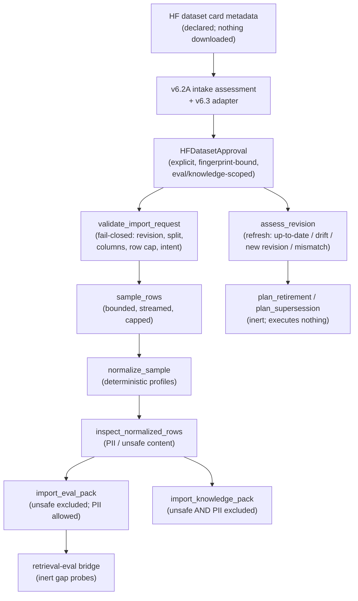

# Concept Cells

An experimental memory architecture based on the high-dimensional separation
theorems from Tyukin, Gorban et al. (2018), *High-Dimensional Brain: A Tool
for Encoding and Rapid Learning of Memories by Single Neurons*.

## Status

Preliminary. Six experiments completed; mechanism demonstrated at small scale
with characterised limits. See **[ARCHITECTURE.md](ARCHITECTURE.md)** for the
full engineering specification — it is the authoritative reference for what
this is, what was tested, and what was not.

## Quick reference

| File | Purpose |
|---|---|
| `ARCHITECTURE.md` | Engineering spec. Read this first. |
| `src/concept_cells/encoders.py` | Encoder wrappers (text + synthetic controls) |
| `src/concept_cells/geometry.py` | Whitening, scaling, separation construction |
| `src/concept_cells/binding.py` | Oja-rule binding mechanism |
| `src/concept_cells/data.py` | Corpus loaders (explicit, no silent fallbacks) |
| `src/concept_cells/persistence.py` | JSONL persistence for stored memories (v0.8) |
| `src/slm/` | Auditable SLM controller layer: schemas + controllers (v0.8) |
| `src/agent/` | Orchestration: memory bank, pipeline, response policy (v0.8) |
| `experiments/exp0*.py` | Numbered experiments; see ARCHITECTURE.md §Experimental record |
| `results/` | JSON summaries and PNG plots generated by experiments |

## Running the experiments

```bash
pip install -r requirements.txt

# Sanity check (5 seconds, CPU only, no downloads):
python -m experiments.exp01_smoke

# Full sweep (5–60 minutes depending on which experiment, GPU recommended):
python -m experiments.exp01_geometry          # static memory geometry
python -m experiments.exp02_confusion         # are confusions semantic?
python -m experiments.exp02b_corpus_compare   # generalises across corpora?
python -m experiments.exp03_rejection         # rejection of novel content
python -m experiments.exp03b_paragraph_leak   # rejection without leakage
python -m experiments.exp04_binding           # Hebbian binding
python -m experiments.exp05_adaptive_theta    # adaptive readout
python -m experiments.exp06_slm_controller    # auditable SLM controller (offline)
```

## v0.8: auditable SLM controller

A frozen small-language-model (SLM) orchestration layer wraps the memory
**without changing any concept-cell geometry**. The SLM only classifies
intent, compresses text for writes, and proposes bindings; it is never the
source of a fact. Every answer is produced from fired memory cells or is an
explicit refusal.

```
user text -> SLM controller (intent) -> encode -> concept-cell bank
          -> fired cells / silence -> response policy -> grounded answer
```

Guarantees enforced by `src/agent/response_policy.py`:

- If no cell fires, the response states memory is silent and cites nothing.
- If cells fire, the answer is built from those memories and cites their ids.
- The SLM cannot introduce an unsupported fact: any cited id that did not
  actually fire is rejected.

The controller ships with a deterministic, rule-based `MockSLMController` (no
downloads, used by all tests) and an optional `LocalSLMController` behind the
same interface for a locally hosted model. Run the integrity suite with:

```bash
python -m pytest evals/ -q          # 13 tests, fully offline
```

## Headline numbers

- Static memory at M=2000 with 100% recognition.
- Novel content rejection at 99.8% (paragraph split) or 100% (article split).
- Hebbian binding at 100% success for m≤5 with zero false fires.
- Hebbian binding at 92% success with 0.08 false fires per trial at m=8.

All on real MiniLM embeddings on Wikipedia. See ARCHITECTURE.md for context
and limits.

## v0.9 stress test

v0.9 adds no new core capability. The concept-cell geometry, whitening,
scaling, write/query and Oja binding are unchanged. It adds a layer of
adversarial pressure on the parts that sit *around* the core: the controllers
that route user text and the encoder that produces vectors.

Three new controllers behind the same `SLMController` interface:

- `RulesController` (`src/slm/rules_controller.py`): a non-LLM keyword/pattern
  baseline. It is 100% JSON-valid and never malformed by construction, so it
  is the floor any model-based controller is measured against.
- `LocalJSONController` (`src/slm/local_json_controller.py`): a strict
  local-SLM controller. It accepts a model name, reaches the model through an
  injectable generation backend, parses and validates the model's JSON, retries
  once on malformed output, and falls back to a safe `QUERY`/`UNKNOWN` intent if
  both attempts fail. It never writes to memory directly.

Two new experiments (offline by default):

```bash
python -m experiments.exp07_real_slm_controller_stress   # writes results/exp07_summary.json
python -m experiments.exp08_encoder_semantic_recall      # writes results/exp08_summary.json
```

- **Exp 07** compares `mock`, `rules`, a guarded `LocalJSONController`, and an
  `unsafe` path that bypasses grounding. The guarded path scores a 0.0
  unsupported-answer rate while the unsafe path scores 1.0 on the same script:
  the grounding policy is what stands between a hallucinating model and the
  user. The scripted backend deliberately emits malformed JSON on some turns to
  exercise the retry-then-fallback path (json_validity 0.7, recovered-on-retry
  2, malformed 0.1).
- **Exp 08** swaps the encoder and holds everything else fixed:
  `deterministic` vs raw MiniLM vs MiniLM passed through the same
  whitening+scaling math as the core. Raw MiniLM lifts paraphrase recall from
  0.0 to 0.8 but false-fires on 0.5 of near-miss/unrelated queries; whitening
  fit on only five memories over-sharpens and collapses paraphrase recall back
  to 0.0. A moderate `epsilon=0.25` (cosine bar ~0.72) is used so paraphrase
  recall is measurable at all.

New policy-guard tests run without any model via a fake backend:

```bash
python -m pytest evals/ -q          # 24 tests, fully offline
```

`evals/test_real_slm_policy_guards.py` covers malformed-JSON fallback, prompt
injection, silent refusal, unsupported-answer prevention, deleted memories that
can no longer be cited, and the invariant that a memory-using response must
carry memory ids.

## v1.0-rc1: semantic calibration

v1.0-rc1 adds no new agent feature and changes no core math. The geometry,
whitening, scaling, write/query, Oja binding, and the grounding policy are all
unchanged. It investigates one question: **can MiniLM-based concept cells
support paraphrase recall while keeping false fires acceptably low?**

It adds two things, both opt-in:

- `src/concept_cells/thresholds.py`: pure, deterministic threshold policies
  (`fixed_threshold`, `per_cell_threshold`, `quantile_threshold`,
  `abstain_band_threshold`, `two_stage_threshold`) plus `sweep_best_threshold`
  for choosing an operating point. These never replace the core firing rule and
  never touch cell vectors; experiments import them to explore calibration.
- `experiments/exp09_semantic_margin_calibration.py`: compares the
  deterministic encoder, raw MiniLM, MiniLM with small-sample whitening, MiniLM
  with large-calibration ZCA / PCA / shrinkage whitening, and an optional 768d
  `all-mpnet-base-v2` model, across exact / paraphrase / near-miss / unrelated /
  adversarial query categories. For each variant it sweeps a firing threshold
  under a false-fire cap and reports recall, per-category false-fire rates,
  silence rate, positive/negative margin percentiles, and margin overlap.

```bash
python -m experiments.exp09_semantic_margin_calibration   # writes results/exp09_summary.json
python -m pytest evals/ -q                                 # 39 tests, fully offline
```

**Honest conclusion (no production claim).** v0.9 proved the controller
guardrails hold. v1.0-rc1 finds that semantic calibration does **not** yet
clear the bar. Raw MiniLM paraphrase recall *did* improve in v0.9, but only by
accepting a false-fire rate that is too high. Under a strict false-fire cap,
Exp 09 finds **no acceptable operating point**: MiniLM places one-word
near-miss flips (`Friday`→`Monday`) at a *higher* cosine than genuine
paraphrases, so a single threshold cannot admit paraphrases without also
admitting near-misses. Small-sample whitening over-sharpens and collapses
paraphrase recall to zero — and larger-calibration ZCA, PCA, and shrinkage
whitening do not rescue it here either. This is a calibration release that
reports a negative result honestly; it is not a claim that the architecture is
production-ready.

## v1.0-rc2: candidate recall + fact verifier

v1.0-rc1 ended on a hard wall: with MiniLM, no single activation threshold
separates genuine paraphrases from one-word near-miss flips, because the encoder
ranks `Friday`→`Monday` *above* real rewordings. v1.0-rc2 stops trying to solve
that with a threshold. Instead it keeps the concept cells as a fast explicit
candidate-memory substrate and adds a **verifier** that decides whether a
retrieved candidate actually preserves the queried fact.

It changes no core math. Geometry, whitening/scaling, write/query, Oja binding,
the grounding policy (`response_policy.py`), and every existing test are
untouched. It adds four opt-in modules and one experiment:

- `src/agent/candidate_retrieval.py`: `retrieve_candidates` returns the top-k
  cells by activation through the bank's public surface only (no geometry
  change, no private access). Candidates are **not** grounding —
  `ground_accepted_candidates` builds a `GroundedResponse` that cites *only*
  candidates a verifier accepted, and refuses otherwise.
- `src/agent/verifier.py`: a pure, deterministic lexical verifier. It rejects a
  candidate on any number, date/weekday, entity, negation, or basic antonym
  mismatch (symmetric and conservative); accepts only exact matches, strong
  containment, or fixture-defined safe paraphrases; otherwise returns
  `AMBIGUOUS` (refuse, do not ground). Number words normalise (`two`==`2`).
- `src/slm/equivalence_judge.py`: an *optional*, injectable SLM second opinion
  behind a Pydantic gate. Hard rule: **it can never override a deterministic
  `REJECT`** (the model is not even consulted), and any malformed output falls
  back to `AMBIGUOUS`.
- `src/slm/schemas.py`: adds `VerificationVerdict`, `MemoryCandidate`, and
  `VerifiedMemoryCandidate` (additive; existing schemas unchanged).
- `experiments/exp10_candidate_verifier.py`: reuses the exact Exp 09 corpus and
  query categories and compares four systems — threshold-only (the Exp 09
  regime), top-1 candidate recall only, top-k + deterministic verifier, and
  top-k + deterministic + optional SLM judge.

```bash
python -m experiments.exp10_candidate_verifier   # writes results/exp10_summary.json
python -m pytest evals/ -q                         # 55 tests, fully offline
```

**Honest conclusion (no production claim).** On the Exp 09 corpus the
deterministic verifier rejects **100%** of the one-word near-miss flips that
threshold-only retrieval grounded, driving the false-accept rate from `0.58`
(threshold-only) and `1.0` (candidate-only) to **`0.0`**, and the
unsupported-answer rate after grounding from `0.29` to **`0.0`**. The price is
deliberate conservatism: paraphrase acceptance drops to the fixture/exact set,
so genuine but unmatched paraphrases are *refused*, not grounded — a safe
failure, not a wrong answer. The offline SLM judge is a conservative stub here
and adds nothing on its own; it exists to show the wiring and the override-proof
guarantee. This is still not a production claim — it is a demonstration that a
cheap lexical verifier catches exactly the failure mode v1.0-rc1 could not.

## Using the Workbench

v1.1 adds a small local **Concept Memory Workbench** on top of the frozen v1.0
architecture. It changes no core geometry, whitening/scaling, write/query,
Oja binding, verifier override rule, or grounding policy — it only composes the
existing v1.0 path (`retrieve_candidates` → `verify_candidate` →
`ground_accepted_candidates`) behind a thin service so a user can write, query,
verify, refuse, delete, inspect, and export memories with a clear audit trail.

Start it (offline; uses the project venv if present). It launches the Streamlit
UI when Streamlit is installed, otherwise an interactive CLI:

```powershell
.\scripts\run_workbench.ps1            # seeds the project memories
.\scripts\run_workbench.ps1 -Demo      # run the Friday -> Monday example
.\scripts\run_workbench.ps1 -NoSeed    # start empty
```

Or directly:

```bash
python app/workbench.py            # interactive CLI REPL
python app/workbench.py --demo     # Friday -> Monday near-miss example
```

CLI commands: `add <text>`, `query <text>`, `delete <memory_id>`, `ledger`,
`demo`, `export [path]`, `help`, `quit`. Every query prints the audit trail —
`candidate_retrieved`, the per-candidate `verifier_verdict`, `memory_used`, and
`refused`.

The **Friday → Monday** example is the smallest illustration of the v1.0 thesis:
a stored "delivery is on Friday" memory is grounded for the exact query, but a
one-word near-miss query ("…on Monday") is *retrieved as a candidate and then
rejected by the verifier*, so it never reaches the user as memory. A deleted
memory cannot be cited at all.

Pieces:

| File | Purpose |
|---|---|
| `app/workbench.py` | Local workbench (CLI, optional Streamlit) |
| `src/agent/workbench_service.py` | Service over the frozen v1.0 path |
| `src/agent/memory_ledger.py` | JSONL memory ledger (active/deleted provenance) |
| `demos/seed_concept_cells_project.jsonl` | Seed memories for the project history |
| `scripts/run_workbench.ps1` | Launcher (Streamlit if available, else CLI) |

```bash
python -m pytest evals/test_workbench_service.py -q   # workbench tests, offline
```

## Importing Notes

v1.2 adds **ingestion with a human approval queue**. You can import a Markdown or
text note, and the workbench extracts *candidate* memories from it — but nothing
is written to memory until you approve it. Extraction is deterministic and
offline (rule-based, **no LLM**): headings become context tags, bullet points
become candidate facts, and lines mentioning a decision, result, limitation,
next step, or similar keyword are prioritised.

The key safety property: **imported notes never write memory silently.** A
candidate only becomes a real memory when a human approves it, and approved
candidates are written through the same frozen v1.0 `add_memory` path. Rejected
candidates are kept in the queue (so the review is auditable) but are never
written, and so can never be retrieved or cited.

CLI commands:

```text
import <path>            extract candidate memories from a note (queued, not written)
proposals                show pending candidates awaiting review
approve <proposal_id>    approve a candidate so write-approved will store it
reject <proposal_id>     reject a candidate (it is never written)
edit <proposal_id> <text>  edit a candidate's text before approving
write-approved           write only approved candidates into the ledger
queue-export [path]      write the proposal queue JSONL
```

Typical flow:

```text
workbench> import demos/seed_ingestion_note.md
  imported 10 candidate(s) ... (queued as pending; nothing written yet)
workbench> proposals
  prop-xxxxxxxx  [decision] (conf 0.80, L11)  Decision: keep the v1.0 geometry frozen ...
  ...
workbench> approve prop-xxxxxxxx
workbench> reject prop-yyyyyyyy
workbench> write-approved
  wrote mem-0001: "Decision: keep the v1.0 geometry frozen ..."
workbench> query keep the v1.0 geometry frozen   # now grounded; rejected never appears
```

Pieces:

| File | Purpose |
|---|---|
| `src/agent/note_ingestion.py` | Deterministic, rule-based candidate extraction |
| `src/agent/memory_proposals.py` | Proposal data model (status, kind, provenance) |
| `src/agent/proposal_queue.py` | JSONL approval queue (pending/approved/rejected/edited) |
| `demos/seed_ingestion_note.md` | Example note for the import workflow |

```bash
python -m pytest evals/test_ingestion_approval.py -q   # ingestion tests, offline
```

## Memory Lifecycle

v1.3 adds **lifecycle management** so memory quality holds up over time. When a
candidate is imported (or re-checked), the workbench compares it against the
current memories and assigns a **lifecycle verdict** before you approve it:

| Verdict | Meaning |
|---|---|
| `new` | Unrelated to any existing memory — safe to approve normally |
| `possible_duplicate` | High lexical overlap, no contradiction — likely a restatement |
| `duplicate` | Exact restatement of an existing memory |
| `possible_conflict` | The verifier rejects it against a memory, lower overlap |
| `conflict` | The verifier rejects it against a closely-related memory (a real contradiction) |

Detection reuses the **frozen v1.0 verifier** for the contradiction signal (so a
`Friday -> Monday` weekday flip is caught exactly as in the core demo) plus a
lexical overlap measure for duplicates. No geometry, whitening, scaling, or
grounding logic is touched.

**Safety gate.** A plain `approve` **refuses** a candidate flagged `duplicate` or
`conflict` — it returns false and writes nothing. Writing a contradiction is only
possible through an explicit action:

- `approve-new <proposal_id>` — keep the candidate as its **own new memory**,
  alongside the existing one (supersedes nothing).
- `approve-supersede <proposal_id> <old_memory_id>` — approve the candidate and
  mark the old memory **superseded**. On `write-approved` the old memory is
  recorded as `superseded` in the ledger **and removed from the bank**, so it can
  no longer be retrieved or grounded as the current answer. The supersession
  chain is preserved for audit (`supersedes` / `superseded_by`).

This gives three distinct memory states — `active`, `superseded`, and `deleted`.
A **superseded** memory is history: it stays in the ledger but is never the
current grounded answer. A **deleted** memory is likewise gone from the bank and
can never be cited. A memory may also be flagged **disputed** when two
contradictory memories are deliberately kept side by side; the ledger records
`conflicts_with` on both so the unresolved contradiction stays visible.

**Current vs historical.** A normal `query` only ever grounds on *current*
memories — a superseded memory was removed from the bank, so it can never be
retrieved or cited as the answer. To inspect what a memory *used to say*, use
`query-history`: it answers exactly like `query` (same grounding, same verifier)
and additionally surfaces any superseded memories whose text overlaps the query,
clearly labelled as history and never presented as the current answer. Deleted
memories are never surfaced, even by `query-history`.

CLI commands:

```text
conflicts                  show pending candidates that conflict with a memory
duplicates                 show pending candidates that duplicate a memory
analyse <proposal_id>      re-check a candidate against the current memories
approve-new <proposal_id>  force-approve a flagged candidate as a new memory
approve-supersede <proposal_id> <old_memory_id>  approve and replace an old memory
show-memory <memory_id>    show a memory and its supersession history
query-history <text>       query, also surfacing superseded memories as history
```

Typical flow (the supplier delivery date changes from Friday to Monday):

```text
workbench> import demos/seed_lifecycle_note.md
workbench> conflicts
  prop-xxxxxxxx  [fact] ...  the supplier delivery is on Monday afternoon
      lifecycle: CONFLICT vs mem-0001 — verifier rejected against mem-0001
workbench> approve prop-xxxxxxxx
  approved prop-xxxxxxxx: false (flagged duplicate/conflict — use approve-new or approve-supersede)
workbench> approve-supersede prop-xxxxxxxx mem-0001
workbench> write-approved
workbench> show-memory mem-0001
  mem-0001  [superseded]  the supplier delivery is on Friday afternoon
      superseded_by: mem-0002 (current: mem-0002)
workbench> query when is the supplier delivery   # Friday memory is no longer grounded
workbench> query-history the supplier delivery is on Friday   # shows the old Friday memory as history
```

Pieces:

| File | Purpose |
|---|---|
| `src/agent/memory_lifecycle.py` | Duplicate + conflict detection (reuses the frozen verifier) |
| `src/agent/memory_ledger.py` | `superseded` / `disputed` status, `supersedes` / `superseded_by` chain, `conflicts_with` links |
| `demos/seed_lifecycle_note.md` | Example note with a duplicate, a date conflict, and a supersession |

```bash
python -m pytest evals/test_memory_lifecycle.py -q    # lifecycle tests, offline
```

## Knowledge Import

Project **memory** and external **knowledge** are deliberately separate. A memory
is something you decided or recorded through the workbench — it can be cited as a
project decision. Knowledge is reference material you imported from an outside
source (docs, a manual, a reference page) — it is informational, carries its own
provenance, and is **never** treated as a project decision. The two live in
different stores (the concept-cell bank/ledger for memory, the knowledge library
for imported sources) and are queried through independent paths, so a knowledge
chunk can never masquerade as a memory and a memory can never be returned as an
external reference.

Each imported source records a **domain** and an **authority**:

- **Domains**: `coding`, `medical`, `legal`, `microsoft`, `general`,
  `project_docs`.
- **Authority**: `official` (the vendor/standard itself), `reputable` (a
  well-regarded secondary source), `community`, or `unknown`. Community and
  unknown sources are flagged at query time so you know to verify.

Domain safety rules are applied at query time:

- **Medical** and **legal** answers are always marked *informational only* —
  never a diagnosis, prescription, or legal-advice claim — and always carry their
  source metadata.
- **Coding** answers include the source's version when known, and warn when the
  version is unknown (behaviour can differ across versions).

### Commands

```text
import-knowledge <path> --domain <d> --authority <a> --name <n> [--version <v>]
sources
query-knowledge <text>
query-all <text>
```

### Example

```text
workbench> import-knowledge demos/seed_coding_knowledge.md --domain coding --authority official --name "Concept Cells Notes" --version 1.0
  imported 'Concept Cells Notes' as src-... (8 chunk(s)); not written as project memory

workbench> sources
  src-...  Concept Cells Notes  [coding/official] v=1.0  chunks=8

workbench> query-knowledge how do I validate with Pydantic
  knowledge_used      = true
  domain              = coding
  informational_only  = false
  ! Coding source 'Concept Cells Notes' is version 1.0.

workbench> query-all what did we decide about the supplier delivery
  route               = memory_only
  memory_used         = true
  knowledge_used      = false
```

`query-all` routes the query (a decision/agreement phrasing goes to memory, a
documentation phrasing goes to knowledge, a medical phrasing goes to knowledge
with a caution, anything ambiguous checks both) and labels each side separately.
When neither memory nor knowledge can answer, `model_prior_used` is set so it is
clear any reply would be the model's ungrounded prior.

| File | What it adds |
|---|---|
| `src/agent/knowledge_sources.py` | Source / document / chunk model with domain + authority |
| `src/agent/knowledge_library.py` | JSONL-backed import store (separate from the ledger) |
| `src/agent/knowledge_retrieval.py` | Chunk retrieval, parallel to candidate retrieval |
| `src/agent/query_planner.py` | Rule-based memory / knowledge / both routing |
| `demos/seed_coding_knowledge.md` | Example coding doc to import |

```bash
python -m pytest evals/test_knowledge_import.py -q    # knowledge import tests, offline
```

## Semantic Knowledge Retrieval

v1.3 retrieved imported knowledge with the same content-addressed firing math the
memory bank uses. That is perfect for CI — fast, no download, reproducible — but
it is **not semantic**: the deterministic encoder hashes the whole string, so a
paraphrase of a chunk is essentially an orthogonal random vector. v1.4 adds an
optional semantic backend behind one interface so the same workbench can retrieve
real coding/project docs *by meaning*.

Two interchangeable backends (`src/agent/retrieval_backends.py`):

| Backend | When | Behaviour |
|---|---|---|
| `deterministic` (default) | tests, CI, offline | Reproduces v1.3 retrieval exactly. Nails exact wording, ~chance on paraphrase. |
| `semantic` (optional) | real docs | MiniLM cosine similarity. Retrieves by meaning, so paraphrases still rank the right chunk. |

Selection precedence: the constructor argument wins, otherwise the
`KNOWLEDGE_RETRIEVAL_BACKEND` environment variable, otherwise `deterministic`:

```bash
# default — offline, reproducible
python -m app.workbench

# opt into semantic retrieval (loads MiniLM lazily)
set KNOWLEDGE_RETRIEVAL_BACKEND=semantic    # PowerShell: $env:KNOWLEDGE_RETRIEVAL_BACKEND="semantic"
python -m app.workbench
# then inside the REPL:
backend
```

Honest boundaries:

- **No silent downloads in tests.** The MiniLM import is lazy; importing the
  backend module never triggers a download, so the suite stays offline.
- **Graceful fallback.** If `semantic` is requested but the model cannot load,
  the workbench falls back to `deterministic` and reports it — it never breaks.
- **Retrieval is not truth.** A retrieved chunk is an external reference, never a
  project decision. Source name / domain / authority / version stay mandatory and
  every candidate records which backend produced it (`backend_name`).
- **No firing gate.** Knowledge retrieval always returns top-k; relevance is the
  reader's call against the activation and a threshold, not a hard cutoff.

```bash
python -m pytest evals/test_knowledge_retrieval_backends.py -q   # backend tests, offline
python -m experiments.exp13_knowledge_retrieval_quality          # deterministic vs semantic
```

`exp13` imports a controlled corpus and compares both backends. With MiniLM
available the contrast is the whole point: deterministic recall@1 ≈ 0.67 (exact
wording only), semantic recall@1 = 1.0 (paraphrases included), both with zero
false retrievals, zero deleted-source citations, and zero memory pollution.

| File | What it adds |
|---|---|
| `src/agent/retrieval_backends.py` | Deterministic + semantic backends behind one Protocol |
| `experiments/exp13_knowledge_retrieval_quality.py` | Retrieval-quality comparison, writes `results/exp13_summary.json` |

## Hybrid Knowledge Retrieval (v2.2)

v2.2 adds a third, **opt-in** knowledge backend that *composes* the two above
instead of choosing between them. The hybrid backend blends three signals per
candidate chunk and records why each one was selected or rejected:

- a **keyword** overlap score (token-level lexical overlap — paraphrase-robust
  in a way the whole-string-hash deterministic encoder is not);
- an optional **semantic** cosine score, only when an embedding component is
  supplied (never loaded implicitly, so the default stays offline);
- a gentle **authority** multiplier from the source metadata, plus an
  exact-phrase bonus so a verbatim match outranks a paraphrase.

It is enabled exactly like the semantic backend — constructor argument, else the
`KNOWLEDGE_RETRIEVAL_BACKEND` environment variable:

```bash
set KNOWLEDGE_RETRIEVAL_BACKEND=hybrid   # PowerShell: $env:KNOWLEDGE_RETRIEVAL_BACKEND="hybrid"
python -m app.workbench
```

The retrieval route decision is exposed in the audit. Each knowledge query
audit gains a `retrieval` block (backend used, blend weights, per-candidate
keyword/semantic/combined scores, and rejected candidates with reasons), and
each selected candidate carries its `keyword_score`, `semantic_score`,
`combined_score`, and `exact_match` flag.

**Honest limitations — read these before trusting it:**

- **The default offline embedder is lexical, not neural.** `OfflineHashingEmbedder`
  (`src/retrieval/embedding_backend.py`) is a deterministic bag-of-words hash:
  texts that *share tokens* score close together, but genuine synonyms with no
  shared words do not. It exists so the hybrid path is testable offline and
  reproducibly — it is **not** semantic understanding. For real meaning-based
  recall, inject a true model (e.g. MiniLM via the `semantic` backend's embedder).
- **The offline recall win is driven by token overlap.** When the hybrid backend
  out-recalls the deterministic backend on a paraphrase in the offline suite, the
  cause is lexical token matching (a signal the whole-string-hash backend lacks),
  optionally corroborated by the bag-of-words embedding — not neural semantics.
- **Default behaviour is unchanged.** The default backend stays `deterministic`
  and offline; nothing here is mandatory. The audit enrichment is additive — the
  deterministic backend exposes no `retrieval` block, so existing audits are
  byte-for-byte identical.
- **Safety is inherited, not re-decided.** Deleted/inactive chunks are excluded
  upstream (and defensively filtered again), stale sources are *labelled* (never
  silently promoted), the memory near-miss verifier and superseded/lifecycle
  rules run on a separate path, and AnswerGuard still runs after composition. The
  hybrid backend only reorders the chunks it is handed.
- **Graceful fallback.** If a supplied embedder fails to construct or throws at
  index/query time, the backend degrades to keyword + geometry, stops reporting
  `is_semantic`, and never crashes a query.

```bash
python -m pytest evals/test_hybrid_retrieval.py -q   # hybrid backend tests, offline
```

| File | What it adds |
|---|---|
| `src/retrieval/scoring.py` | Pure score-blending + auditable retrieval report |
| `src/retrieval/embedding_backend.py` | Offline deterministic token-hashing embedder (lexical, not neural) |
| `src/retrieval/hybrid_backend.py` | Hybrid backend composing deterministic + optional semantic |

## Project Packs

v1.6 adds **project packs**: isolated workspaces so unrelated projects never
share memory. Each pack is a self-contained directory with its own memory
ledger, proposal queue, knowledge library, persisted concept-cell bank, and
runtime settings. Queries only ever see the **active** pack, so a memory or an
imported document in one pack is invisible from another.

A pack lives under a pack root (default `demos/packs/`):

```
demos/packs/<pack_id>/
  manifest.json     # pack metadata + runtime settings
  bank.jsonl        # persisted concept cells (vectors + ids)
  ledger.jsonl      # memory ledger
  proposals.jsonl   # ingestion proposal queue
  knowledge.jsonl   # imported knowledge library
```

Open a pack from the CLI and switch between packs at any time:

```bash
python app/workbench.py --pack concept-cells      # open (or create) a pack
# or, from inside the REPL:
#   packs                       list packs (the active one is marked *)
#   pack-create <name>          create a new pack
#   pack-use <name>             switch the active pack (re-points every store)
#   pack-info [name]            show a pack's paths and counts
#   pack-export <name> <path>   export a pack to a .zip bundle
#   pack-import <path>          import a pack bundle
```

The PowerShell launcher forwards the same options (using `-Pack` forces the CLI,
since Streamlit does not pass script arguments):

```powershell
.\scripts\run_workbench.ps1 -Pack concept-cells
.\scripts\run_workbench.ps1 -Pack coding-reference -PackRoot demos\packs
```

**Isolation guarantee.** Two demo packs ship as worked examples:
`concept-cells` (project memory seeded from its own history) and
`coding-reference` (imported coding knowledge). Add the same fact to one and
query it from the other — the second pack stays silent, because each pack reads
and writes only its own files. Exporting a pack zips its manifest and all four
stores into one bundle; importing it elsewhere restores the manifest and the
data intact.

This layer adds no geometry: the concept-cell core, whitening/scaling,
write/query construction, the verifier's REJECT override, and the grounding
policy are unchanged. A pack only decides *where* the existing stores live.

| File | What it adds |
|---|---|
| `src/agent/project_packs.py` | `ProjectPack`, `PackManifest`, `PackRegistry` (create/switch/export/import) |
| `evals/test_project_packs.py` | Isolation, switching, and export/import tests |
| `demos/packs/` | Two worked-example packs (`concept-cells`, `coding-reference`) |

## Review Console

v1.7 adds a **review console**: a local operator UI for running a project pack,
reviewing pending proposals and conflicts, inspecting memories and knowledge,
and running audited queries. It is a thin surface over the workbench — every
action goes through the same service methods, so the console only *shows* the
existing approval gates and grounding policy, it never bypasses them.

**What it is.** A read-and-decide cockpit for an operator: see the dashboard at
a glance, approve or reject proposals, resolve duplicates and conflicts (approve
as new, approve superseding, or mark a memory disputed), browse the memory table
by lifecycle status, list imported knowledge sources, run a query and read its
full audit trail, and export the active pack.

**What it is not.** It adds no memory logic. Writes still require explicit
approval, a hard duplicate or conflict still refuses a plain approve, and a
query that nothing grounds is reported as the model's ungrounded prior — exactly
as in the workbench.

Launch the console (text-mode by default; the web UI is used automatically when
Streamlit is installed):

```bash
python app/review_console.py --pack concept-cells   # text-mode operator console
streamlit run app/review_console.py                  # web UI, if Streamlit is installed
```

The PowerShell launcher forwards the same options (using `-Pack` forces the CLI,
since Streamlit does not pass script arguments). If Streamlit is not installed
it prints how to add it and falls back to the CLI:

```powershell
.\scripts\run_review_console.ps1 -Pack concept-cells
```

Inside the REPL, `help` lists every command. The core flow:

```
dashboard                 pack, proposal, conflict, memory, and knowledge counts
proposals                 list pending proposals
conflicts                 list duplicates and conflicts
approve <id>              approve a clean proposal (refused if it is flagged)
approve-new <id>          approve a flagged proposal as a new memory
supersede <id> <old_id>   approve a proposal that supersedes an existing memory
reject <id>               reject a proposal
dispute <mem_id> [other]  mark a live memory disputed (it stays citable)
write-approved            write approved proposals into the bank
memories                  show memories grouped by lifecycle status
knowledge                 list imported knowledge sources
query <text>              run an audited query and show its full route
export <path>             export the active pack to a .zip bundle
```

The CLI workbench remains fully supported; the console is an additional view,
not a replacement. Streamlit is optional and only used when it is installed.

| File | What it adds |
|---|---|
| `app/review_console.py` | Operator UI (text-mode REPL + optional Streamlit) |
| `src/agent/review_service.py` | Thin orchestration over `WorkbenchService` (no new memory logic) |
| `evals/test_review_service.py` | Dashboard, proposal/conflict review, audit, and no-bypass tests |
| `scripts/run_review_console.ps1` | Launcher (web UI if Streamlit is present, else CLI) |

## Curated Knowledge Packs

v1.8 adds a **curated knowledge pack builder**: a way to build real-world
knowledge packs from named, provenance-tagged sources, then validate retrieval
and source behaviour with pack-specific evaluation questions before relying on
the pack. It is additive — building reuses the frozen knowledge-import path and
evaluating reads through the same `query_knowledge` route, so no geometry,
grounding policy, or lifecycle semantics change.

**Why curated, not a random dump.** A pack you trust for answers should be built
deliberately. Each source carries its own provenance — domain, authority,
version, licence, retrieval date, and a staleness policy — so every retrieved
chunk can be traced back to a known document, not an anonymous scrape.

**Coding first.** The starter packs build from local demo and project docs only.
`coding-reference` is built from `demos/seed_coding_knowledge.md`;
`concept-cells-docs` is built from the repository's own `ARCHITECTURE.md` as
curated project documentation.

**Medical is guarded.** The medical pack ships only as a disabled example
(`packs/starter/medical_reference_pack.yaml.example`, `enabled: false`). Medical
content is flagged informational-only on every answer, and its evaluation
questions require that flag before the pack is trusted. To use it you must
supply your own licensed local source and explicitly enable it.

**Source metadata.** A source spec records `source_name`, `path_or_url`,
`domain`, `authority`, `version`, `licence`, `retrieved_at`, and
`staleness_policy`. Local files are supported first; URL ingestion is scaffolded
but disabled, and a URL source is recorded as *skipped* (never fetched silently)
unless ingestion is explicitly enabled.

**Evaluation questions.** A pack's eval file (JSONL) asserts what its retrieval
should return for known queries: the expected domain, source, and authority,
that a retrieved chunk contains a known phrase, that forbidden terms never
appear, and that safety flags such as `informational_only` are set. Running the
eval produces a pass/fail report per question.

Build the local starter packs (local docs only, no web access) and validate
them:

```powershell
.\scripts\build_starter_packs.ps1
```

Or drive the same steps from inside the workbench REPL:

```
pack-build packs/starter/coding_reference_pack.yaml
pack-eval coding-reference demos/pack_eval_questions/coding_reference_eval.jsonl
pack-report coding-reference
```

| File | What it adds |
|---|---|
| `src/agent/pack_builder.py` | Pack build plan/specs and local-source import with provenance |
| `src/agent/pack_evaluator.py` | Retrieval/source validation against pack eval questions |
| `packs/starter/` | Starter pack specs (coding, project docs, guarded medical example) |
| `demos/pack_eval_questions/` | Eval question files for the starter packs |
| `scripts/build_starter_packs.ps1` | Build local starter packs and run their evals |
| `evals/test_pack_builder.py` | Build, metadata, eval pass/fail, URL-gating, and report tests |

## M365 Consultant Pack

v1.9 ships the first **real working pack template**: a Microsoft 365
consulting and project-architecture knowledge pack built entirely from local,
curated Markdown field notes. It is the curated pack builder from v1.8 applied
to a concrete consulting domain — nothing in the concept-cell core, grounding
policy, or lifecycle semantics changes.

**Purpose.** Give a consultant a trustworthy, provenance-tagged answer surface
for common M365 governance and security topics: Purview sensitivity labels,
Endpoint DLP, Defender for Cloud Apps, Copilot Studio agent patterns, Power
Platform DLP, and SharePoint governance. Every source is tagged
`domain: microsoft`, `authority: reputable`, `version: local-notes-v1`, and
`staleness_policy: review_required`, so each retrieved chunk traces back to a
dated field note rather than an anonymous scrape or an unattributed model prior.

**Local sources only.** The six source documents live under
`demos/m365_sources/`. Each one records key facts, decisions and assumptions,
known limitations, worked examples, and source/version metadata in its header.
There is **no live Microsoft Learn ingestion yet** — URL ingestion stays
disabled and the network is never touched during a build.

**How to build.** Build the pack from local docs and run its evaluation in one
step (the script exits non-zero if any eval question fails):

```powershell
.\scripts\build_m365_pack.ps1
```

Or drive the same steps from inside the workbench REPL:

```
pack-build packs/starter/m365_consultant_pack.yaml
pack-eval m365-consultant demos/pack_eval_questions/m365_consultant_eval.jsonl
pack-report m365-consultant
```

**How to evaluate.** The eval file asserts what retrieval should return for
known queries: exact and paraphrase source retrieval, wrong-topic rejection,
that version/source metadata is present, and that answers come from imported
knowledge (`knowledge_used`) rather than model priors. Running the eval produces
a pass/fail report per question.

**How to open in the review console.** The built pack is an ordinary pack, so
the review console can inspect its knowledge sources and confirm that imported
M365 knowledge stays separate from project memory:

```powershell
python app/review_console.py --pack-root packs\built --pack m365-consultant
```

**Limitations.** The notes are a curated starting point, not exhaustive
documentation, and are marked `review_required` for exactly that reason. The
deterministic retrieval backend is keyword-based, so eval queries are tuned to
the curated chunks. There is no live Microsoft Learn ingestion yet — refreshing
a source means editing the local Markdown and rebuilding.

| File | What it adds |
|---|---|
| `demos/m365_sources/` | Six curated M365 field-note Markdown sources with provenance headers |
| `packs/starter/m365_consultant_pack.yaml` | The M365 consultant pack spec (local docs, URL ingestion off) |
| `demos/pack_eval_questions/m365_consultant_eval.jsonl` | Pack-specific retrieval and provenance eval questions |
| `scripts/build_m365_pack.ps1` | Build the M365 pack from local docs and run its eval (exits non-zero on failure) |
| `evals/test_m365_pack.py` | Spec-load, build, metadata, eval, review-console, and memory-separation tests |

## Hugging Face Dataset Imports

Hugging Face hosts thousands of datasets, but *free to download* is not the same
as *safe to trust*. The v1.9 importer lets a consultant pull a small, governed
sample from a dataset into either a pack's knowledge library or its evaluation
samples — without ever bulk-downloading or silently trusting the data.

The importer is safe by construction:

- **Free does not mean trusted.** Every import is gated on the dataset's
  declared provenance before any row is written.
- **Licence checks.** An unknown or undeclared licence is *blocked for knowledge
  mode* and allowed only with a warning for *eval mode*. A policy of
  `require_license` blocks unknown licences in both modes.
- **Dataset cards.** Licence, tags, task categories, size, citation, and
  revision are read from the dataset card. You can require a card to be present
  before any import proceeds.
- **Sample limits.** `sample_size` is capped at 100 rows; a larger request is
  clamped, not honoured. The point is a governed sample, not bulk ingestion.
- **Streaming.** Sampling streams by default, so the full dataset is never
  materialised — only the capped sample is read.
- **Knowledge vs eval mode.** `knowledge` mode writes through the same
  `KnowledgeLibrary` import path as every other source (with full provenance and
  a `review_required` staleness policy). `eval` mode writes a samples file only.
  Neither mode ever writes to the `MemoryLedger`.
- **Coding first.** The bundled demo imports a tiny coding sample.
- **Medical guarded.** `medical` and `legal` domains are refused under an
  `unknown` authority; the medical fixture ships as a guarded `.example`.
- **No silent bulk imports.** With no local fixture and no explicit network
  opt-in, sampling *refuses* rather than downloading. Tests run entirely offline
  on local fixtures.

Inspect a dataset's governance before importing, then import a small sample:

```text
workbench> hf-inspect demo/small-coding --card demos/hf_fixtures/dataset_card_with_license.json
workbench> hf-import demo/small-coding --pack my-pack --mode eval --domain coding --authority reputable \
             --card demos/hf_fixtures/dataset_card_with_license.json \
             --fixture demos/hf_fixtures/small_coding_dataset.jsonl --sample-size 5
```

| File | What it adds |
|---|---|
| `src/agent/hf_metadata.py` | Offline-first dataset card / metadata access with graceful network fallback |
| `src/agent/hf_dataset_importer.py` | The licence-aware, capped, knowledge-vs-eval HF importer |
| `demos/hf_fixtures/` | Offline dataset-card and row fixtures (coding sample, guarded medical example) |
| `scripts/import_hf_sample.ps1` | Disabled-safe demo that imports a tiny coding sample from local fixtures |
| `evals/test_hf_dataset_importer.py` | Licence gating, sample cap, memory separation, and no-silent-download tests |

The pack builder also recognises a `source_type: huggingface_dataset` source in
a pack spec, but HF ingestion stays disabled during a normal build (like URL
ingestion) and must be enabled explicitly — a starter build never samples the
Hub.

## M365 Coding Assistant Pack

v2.0 ships the first **real operational assistant pack**: a single pack that
combines Microsoft 365 governance notes with this project's own coding-stack
notes behind one provenance-tagged, source-governed answer surface. It reuses
the v1.8 pack builder, the v1.9 importer, and the frozen knowledge query path —
nothing in the concept-cell core, grounding policy, or lifecycle semantics
changes.

**Purpose.** Give a working assistant a trustworthy answer surface that spans
two domains at once: M365 governance and security (`domain: microsoft`) and the
project's day-to-day coding stack (`domain: coding`). Every source is tagged
`authority: reputable`, `version: local-notes-v1`, and
`staleness_policy: review_required`, so each retrieved chunk traces back to a
dated field note rather than an anonymous scrape or an unattributed model prior.

**What it can answer.** Eight curated sources under
`demos/m365_coding_sources/` cover Purview sensitivity labels, Endpoint DLP,
Copilot Studio agent patterns, Power Platform DLP, and SharePoint governance on
the Microsoft side, plus Pydantic v2, the Streamlit workbench, and the
PowerShell launcher on the coding side. Each one records key facts, decisions
and assumptions, known limitations, worked examples, a caution / near-miss note,
and source/version metadata in its header.

**What it cannot answer.** Anything outside those eight sources. A cross-cloud
question (for example AWS IAM or S3) has no grounding here, so the pack rejects
it rather than fabricating a source. There is **no live Microsoft Learn
ingestion yet** — URL ingestion stays disabled and the network is never touched
during a build. Refreshing a source means editing the local Markdown and
rebuilding.

**Memory, knowledge, and model prior stay separated.** The combined query path
reports three independent flags. A question answered from a curated source sets
`knowledge_used`; a decision-recall question (for example "what did we decide")
routes to project memory and, against an empty ledger, falls back to
`model_prior_used` with an explicit ungrounded caution. Imported knowledge is
never written to the `MemoryLedger`.

**How to build, evaluate, and demo.** One script builds the pack from local
docs, runs its evaluation, and prints five example questions with their routing
flags (it exits non-zero if any eval question fails):

```powershell
.\scripts\demo_m365_coding_assistant.ps1
```

Or drive the same steps from inside the workbench REPL:

```text
pack-build packs/starter/m365_coding_assistant.yaml
pack-eval m365-coding-assistant demos/pack_eval_questions/m365_coding_assistant_eval.jsonl
pack-report m365-coding-assistant
```

**How to open in the review console.** The built pack is an ordinary pack, so
the review console can inspect its eight knowledge sources across both domains
and confirm that imported knowledge stays separate from project memory:

```powershell
python app/review_console.py --pack-root packs\built --pack m365-coding-assistant
```

**Eval-only HF samples.** A tiny offline Hugging Face coding fixture can be
pulled in **eval mode only** to exercise the assistant; its unknown licence is
allowed for eval (with a warning) but would be blocked for knowledge mode, so it
can never become trusted knowledge. HF eval samples are eval-only unless
explicitly promoted.

| File | What it adds |
|---|---|
| `demos/m365_coding_sources/` | Eight curated M365 + coding field-note Markdown sources with provenance headers |
| `packs/starter/m365_coding_assistant.yaml` | The assistant pack spec (local docs, URL ingestion off, both domains) |
| `demos/pack_eval_questions/m365_coding_assistant_eval.jsonl` | Retrieval, provenance, rejection, and separation eval questions |
| `scripts/demo_m365_coding_assistant.ps1` | Build, evaluate, and demo the pack with memory / knowledge / model-prior flags (exits non-zero on failure) |
| `evals/test_m365_coding_assistant_pack.py` | Spec-load, build, metadata, eval, review-console, routing-flag, memory-separation, and HF eval-only tests |

## SLM-Grounded Assistant Layer

The retrieve → verify → ground path produces a faithful but terse audit. The
**optional** SLM-grounded assistant layer (v2.0) adds a thin *rendering* layer on
top of it that composes a readable answer, explains refusals and conflicts, and
can propose memories — **without ever changing a grounding decision**. It is off
by default, deterministic, and fully offline unless you explicitly wire in a
local model.

### What the SLM can do

- Rewrite the trusted result into readable prose.
- Explain *why* an answer was refused, or why a near-miss was rejected as a
  conflict.
- Optionally suggest candidate memories from a note — which still enter the
  normal human-approval queue like any other proposal.

### What the SLM cannot do

- It cannot decide what is grounded. The mode, the `refused` flag, and the exact
  set of citable ids all come from the deterministic **grounding package**, not
  the model.
- It cannot invent a citation. Any `[mem:…]` / `[src:…]` marker the model emits
  that is not in the allowed set is rejected and the layer falls back to the
  deterministic template.
- It cannot cite on a non-grounded answer, turn a refusal into a grounded one,
  or cite a deleted or superseded memory as the current answer.
- It cannot write to memory or knowledge. Suggested memories are proposals only.

If the model is unavailable, returns malformed output, or violates any of the
rules above, the layer **falls back to the deterministic template** — the safe
answer is always available.

### Local / offline defaults

By default `query-assist` uses the deterministic `TemplateComposer`; no model is
loaded and no network is touched. Tests use an in-process `MockSLMBackend`, so
the whole suite stays offline and reproducible.

### Optional local model

To enable the SLM path, point the layer at a **local** endpoint via environment
variables (nothing is downloaded at import time):

- Ollama: set `OLLAMA_HOST` (and optionally `OLLAMA_MODEL`).
- OpenAI-compatible local server: set `OPENAI_COMPAT_BASE_URL` (and optionally
  `OPENAI_COMPAT_MODEL`, `OPENAI_COMPAT_API_KEY`).

`make_default_slm_backend()` resolves these in order and returns an unconfigured
backend (which always falls back to the template) when none is set.

### Grounding package

`WorkbenchService.build_grounding_package(query)` returns the deterministic
envelope the composer is allowed to render: the mode (`grounded`, `refusal`,
`conflict_explanation`, `model_prior_labelled`, `pack_summary`), the refused
flag, the citable evidence, display-only conflict/near-miss context, and any
historical note. `answer_query(query, use_slm=…)` ties the package and the
composer together and returns an `AssistantResult` carrying the composed answer
plus the full audit trail.

### Examples

In either CLI (`app/workbench.py` or `app/review_console.py`):

```
query-assist the supplier delivery is on Friday afternoon
query-assist --slm what does pydantic validate
```

`demos/assistant_queries.jsonl` lists seven worked scenarios: grounded memory,
grounded knowledge, no-evidence refusal, the Friday→Monday near-miss, a
superseded-memory query, a medical informational query, and a labelled
model-prior answer.

| File | What it adds |
|---|---|
| `src/slm/assistant_composer.py` | Grounding package + `TemplateComposer` / `LocalSLMComposer` (citation validation, safe fallback) |
| `src/slm/local_slm_backend.py` | Injectable backend Protocol with `MockSLMBackend`, Ollama, and OpenAI-compatible local backends |
| `src/slm/proposal_extractor.py` | Optional SLM-assisted memory suggestions that still require human approval |
| `demos/assistant_queries.jsonl` | Seven worked assistant scenarios |
| `evals/test_assistant_composer.py` | Composer safety tests: no invented citations, no grounding of refusals, safe fallback, lifecycle guarantees |

## v2.1 M365/Coding Assistant Pack

The first **practical** domain pack built on the v2.0 assistant layer. It bundles
curated local field notes — Microsoft 365 administration, Purview labels and DLP,
Power Platform / PowerApps formulas, SharePoint / Teams / Copilot Studio, and this
project's own coding-agent workflow rules — into a single grounded pack under
`packs/m365_coding_assistant/`. Nothing in the frozen core, the verifier, the
grounding policy, or the lifecycle changes; this pack is a *consumer* of those
layers, not a modification of them.

**What it answers.** Questions grounded in its five sources across two domains
(`microsoft` and `coding`): least-privilege admin roles and break-glass accounts,
sensitivity labels and DLP modes, Power Fx functions and delegation warnings,
SharePoint external sharing and Copilot Studio grounding, and the coding agent's
minimum-change / verification-loop conventions.

**What it refuses.** Off-topic and unsupported questions are not answered. A
decision-recall query with no matching project memory produces an explicit
refusal, never a guess. Model-prior output is only produced when
`allow_model_prior` is explicitly set, and it is clearly labelled as ungrounded.

**Citations.** Grounded answers cite only the source chunks present in the
grounding package (`[src:<chunk-id>]`). An optional local SLM may render the same
answer but can never cite a source that is not in the package — a fabricated
citation makes the composer fall back to the safe template.

**Stale and conflicting evidence.** The Power Platform notes are flagged
`stale`; any answer touching them carries a query-time caution that the source
may be outdated and should be verified against current guidance (added via
`_staleness_cautions`, additive only). Conflicting project decisions are rejected
by the verifier and surfaced as a conflict explanation rather than grounded.

**Rebuild the pack.**

```
python scripts/build_m365_coding_pack.py
```

This validates the manifest's declared `policy` block (local-only sources, no
medical/legal domains, allowed knowledge types), builds the five sources into
`packs/built/`, prints provenance and the stale flag, and then runs the eval gate.

**Run the evals.**

```
python scripts/build_m365_coding_pack.py          # build + retrieval/provenance eval gate
python -m pytest evals/test_m365_coding_pack.py    # build + assistant-safety tests
```

**Use it live.**

```
python app/workbench.py --pack-root packs\built
workbench> pack-use m365-coding-assistant-v21      # or: pack-switch
workbench> query-assist <text>                     # template composer
workbench> query-assist --slm <text>               # optional local SLM, safe fallback
```

**Limitations (honest).** The default retrieval backend is a deterministic
whole-string encoder, so it is exact-match, not semantic: the eval queries in
`evals/m365_coding_pack_eval.jsonl` are verbatim source excerpts because a
paraphrase will not reliably rank the target chunk. That JSONL therefore
validates **retrieval and provenance** only (domain, source, authority, chunk
content, forbidden-term absence). The **assistant-safety** guarantees — refusal
on missing evidence, stale labelling, model-prior labelling, and SLM citation
bounds — are validated separately in `evals/test_m365_coding_pack.py`. Because a
populated knowledge library always returns a chunk, refusal is reachable through
the memory route (an unanswered decision-recall query), as the tests demonstrate.

| File | What it adds |
|---|---|
| `packs/m365_coding_assistant/pack.yaml` | Manifest with five local sources + declared `policy` block |
| `packs/m365_coding_assistant/sources/*.md` | Five curated field-note sources (M365 + coding) |
| `scripts/build_m365_coding_pack.py` | Policy-validating build + eval gate |
| `evals/m365_coding_pack_eval.jsonl` | 20 retrieval/provenance questions (17 grounded, 3 rejection) |
| `evals/test_m365_coding_pack.py` | Build + assistant-safety tests (refusal, stale, model-prior, SLM bounds) |
| `demos/m365_coding_assistant_queries.jsonl` | Ten worked assistant scenarios for this pack |

## v2.2 Source Refresh & Pack Maintenance

A read-only maintenance layer that keeps existing pack knowledge **trustworthy
over time**. It does not add knowledge; it reports which sources have gone — or
are going — stale so an operator can act before a stale-but-cited answer
misleads someone. It changes no frozen core semantics: the verifier, grounding,
citation, lifecycle, refusal, SLM-optional, TemplateComposer-default, and
pack-isolation rules are all untouched, and the existing tests stay green.

Every source already carries provenance (`staleness_policy`, `retrieved_at`,
`published_at`, `version`). This layer reads those fields plus a per-pack
**freshness policy** and assigns each source one of four statuses:

| Status | Meaning |
|---|---|
| `current` | Trusted as up to date (declared `static`, or young enough). |
| `review_due` | Flagged for human review (declared `review_required`, or past the review threshold but not yet stale). |
| `stale` | Declared `stale`/`outdated`/`deprecated`, or older than its stale window. |
| `unknown` | No date recorded, so age cannot be assessed. |

Declared policies short-circuit the age check, so `stale` is always `stale` and
`review_required` is always `review_due` regardless of dates. Otherwise the
status is time-based: a source flips to `review_due` at `review_due_fraction` of
its window and to `stale` at the full window. Windows come from the manifest's
`policy.freshness` block:

```yaml
policy:
  freshness:
    default_stale_after_days: 365
    domain_stale_after_days:
      microsoft: 180        # M365 guidance moves faster than general notes
      coding: 365
    review_due_fraction: 0.8  # warn at 80% of the window
```

### Workbench commands

| Command | What it shows |
|---|---|
| `pack-sources [--stale] [--json]` | Freshness status for every active source; `--stale` hides current ones |
| `pack-refresh-plan [--json]` | Non-current sources ranked by risk, each with a suggested action |
| `pack-maintenance-report [--json]` | Source-health summary (current/review_due/stale/unknown) |

The build script `scripts/build_m365_coding_pack.py` also prints a maintenance
report after the eval gate, folding in the eval pass numbers so source freshness
and eval status are visible together.

| File | What it adds |
|---|---|
| `src/agent/pack_maintenance.py` | Pure, read-only freshness analysis (status, inventory, refresh plan, report) |
| `evals/test_pack_maintenance.py` | Unit tests + a real M365-pack maintenance test |
| `packs/m365_coding_assistant/pack.yaml` | `policy.freshness` block |

### Honest limitations

* **No automatic refresh.** This layer does not fetch the web or re-import
  anything. It reports staleness; a human refreshes the source and rebuilds the
  pack. The deterministic, offline backend makes metadata-driven maintenance the
  honest design — there is no silent substitution of "newer" content.
* **Operator owns the judgement.** `review_required`/`stale` are operator
  declarations in the manifest. The layer surfaces and ranks them; it does not
  decide whether a source is actually correct.
* **Lifecycle write-actions are deferred.** Marking a source reviewed, historical,
  or retired — and the query-assist refusal behaviour that retiring a source
  would enable — changes *citation eligibility*. That is a separate, ratified
  step and is intentionally **not** in this read-only slice.

## v2.1.1 Value Sprint (read-only instrumentation)

The Value Sprint measures whether the M365 / Coding pack produces *practical
value* on real recurring workflows — without adding architecture. It runs a
fixed query set through the **frozen** assistant path (template composer,
offline, no SLM) and records an audit row per query: how it routed, whether it
grounded and cited, whether it was refused, whether a stale source was flagged,
and whether it grounded when it should not have.

```bash
python scripts/run_value_sprint.py            # writes results/value_sprint_report.md
python scripts/run_value_sprint.py --jsonl results/value_sprint_rows.jsonl
```

Each row carries six audit fields: `route`, `refused`, `citations_count`,
`stale_warning`, `model_prior_used`, and an `answer_snippet`. The report tallies
**useful answers, refusals, missing evidence, stale evidence, false groundings,
and pack gaps**.

| File | What it adds |
|---|---|
| `src/agent/value_sprint.py` | Pure, read-only sprint runner, summary, and Markdown report |
| `demos/value_sprint_queries.jsonl` | 10 realistic queries (verbatim, paraphrased, out-of-domain) |
| `scripts/run_value_sprint.py` | Builds the pack, runs the sprint offline, writes the report |
| `evals/test_value_sprint.py` | Deterministic tests over a real pack build |

### Honest finding

Running the sprint surfaced a real, measured result that contradicts the
intuitive story. The deterministic retrieval backend is **over-permissive**: it
returns a broad fixed citation set for almost any query — verbatim, paraphrased,
or entirely out-of-domain (an AWS question still grounded an irrelevant coding
chunk). So `grounded + cited` means *evidence was retrieved*, **not** *the answer
is relevant*; citation count is not a relevance signal with this backend.

What genuinely delivers value today is **trust behaviour**, not broad retrieval:

* **Refusal on no evidence.** An empty-ledger decision-recall query refuses
  cleanly instead of inventing an answer.
* **Stale-source flagging.** Answers that cite the stale PowerApps source carry
  a stale caution.
* **Grounding guard.** Even when an irrelevant source is cited for the AWS
  query, forbidden terms (`AWS`, `S3 bucket`, `Lambda`) never leak into the
  answer.

Relevance-ranked retrieval — actually answering the specific question asked —
would need a semantic backend or SLM. The sprint is the instrument that makes
that gap visible and measurable; it deliberately does **not** paper over it.

## AnswerGuard: composer-agnostic answer verification

`src/slm/answer_guard.py` is an independent, deterministic check that runs over
a **finished** `ComposedAnswer` after composition. Where the composer renders a
`GroundingPackage` into prose, the guard verifies the prose did not drift from
the package:

* no citation that is not in the package's allowed evidence (no invented sources);
* a non-grounded answer (refusal / conflict / model-prior) cites nothing;
* a refusal was not silently softened into a confident answer;
* a model-prior answer is labelled as such and never presents as grounded;
* the answer's mode matches the package's mode (no relabelling);
* a stale-source caution in the package is still surfaced in the prose.
* every per-span citation (v2.6) is a *verbatim substring* of the evidence item
  it cites — no unsupported bridging text (a no-op for whole-chunk composers,
  whose `spans` list is empty).

**Why this exists when `LocalSLMComposer` already validates its own output.**
That internal check only guards the *SLM* path, as a silent fallback trigger.
But `WorkbenchService.answer_query` / `compose_answer` accept an **arbitrary**
`composer=...`. A custom or future composer is not bound by that internal check.
The AnswerGuard is composer-agnostic: it runs on every answer and emits an
explicit `ACCEPT` / `REJECT` verdict that lands in the audit trail
(`result.audit["guard"]`).

Honest scope: this is **defence-in-depth plus an audit verdict**, not a fix for
a live failure in the default path. The built-in `TemplateComposer` (default)
and `LocalSLMComposer` are correct by construction, so they always pass — the
guard's genuinely new value is (1) catching a misbehaving *custom* composer and
(2) recording a transparent verdict on every answer. `enforce()` is the safe
wrapper: on `REJECT` it discards the offending answer and recomposes
deterministically with the template, so a rogue composer cannot leak a
fabricated, mislabelled, or refusal-softening answer to the caller.

This is the assistant layer's "immune system" / critic. It does **not** rebuild
the existing intent/route/proposal/approval pipeline (those already exist) and
it never relaxes a frozen rule — it only observes the composed answer.

Tests: `evals/test_answer_guard.py` (template passes on every mode; each
violation type is caught on a deliberately-rogue composer; `enforce` recomposes
safely; `answer_query` records the verdict).

## v2.3 Value Sprint Harness (daily brain loop)

The v2.3 harness exists to **stop adding hidden architecture and measure whether
the system produces practical value** on real Brad / M365 / coding workflows. It
is an evolution of the v2.1.1 Value Sprint: same read-only, frozen-path
discipline, but a richer schema that captures the *trust* signals (conflict,
stale, model-prior, AnswerGuard verdict, retrieval backend) and turns weak or
refused answers into **advisory pack-gap proposals**. It changes no v1.0 core
semantics and adds no new grounding, verifier, lifecycle, refusal, citation, or
pack-isolation behaviour — it only observes and reports.

### How to run

```powershell
python app/workbench.py value-sprint run                              # deterministic backend (default)
python app/workbench.py value-sprint run --backend hybrid             # opt-in hybrid retrieval
python app/workbench.py value-sprint run --pack m365_coding_assistant # choose the pack
python app/workbench.py value-sprint report                           # re-render Markdown from the JSONL
```

`run` builds the named pack into a throwaway temporary registry, seeds a handful
of demo project memories (into that temporary ledger only — never a tracked
store) so the memory-routed paths can fire, runs every query in
`demos/value_sprint_queries.jsonl` (25+ realistic questions across project
decision recall, M365 consulting, Purview labels, PowerApps formulas, Copilot
Studio architecture, coding-agent prompts, repo milestones, stale handling,
conflict, no-evidence refusal, model-prior, and pack-gap detection), and writes
two reports:

* `reports/value_sprint_latest.md` — a human-readable per-query audit table;
* `reports/value_sprint_latest.jsonl` — one machine-readable row per query.

Each row records: `query`, `expected_outcome`, `actual_mode`, `refused`,
`citations_count`, `stale_warning`, `conflict_warning`, `model_prior_used`,
`retrieval_backend`, `guard_verdict`, `outcome_label`, `pack_gap_detected`, and
(when relevant) `suggested_pack_update`, plus an `operator` block.

### How to interpret the labels

The harness records *machine* outcomes automatically; the **operator** columns
are for human judgement and are captured, never inferred. After a run, edit the
JSONL to fill in each `operator` block, then `value-sprint report` re-renders
the Markdown from your edits without re-running queries:

| Operator field | Meaning |
|---|---|
| `useful` | Did the answer actually help the workflow? (yes/no) |
| `saved_time` | Did it save time versus doing it by hand? (yes/no) |
| `reusable_output` | Is the output reusable as-is? (yes/no) |
| `trust_level` | How much do you trust it? (high/medium/low) |
| `notes` | Free-text rationale |

`outcome_label` summarises the machine outcome (`grounded+cited`,
`honest_refusal`, `conflict_explained`, `model_prior_labelled`, …); `met` in the
table is whether the machine outcome matched the query's `expected_outcome`.

### Turning pack gaps into approved updates

When a query that expected value is refused (or is an explicit gap probe), the
harness emits a `suggested_pack_update` proposal: a missing topic, a suggested
source type (`knowledge_source` or `memory_proposal`), a candidate memory, and
the affected query. **These are proposals only — the harness never writes to the
`MemoryLedger` or `KnowledgeLibrary`.** To act on one, an operator follows the
existing, ratified paths: import an authoritative source through the pack
builder / knowledge import for a `knowledge_source` gap, or add a memory through
the normal human-approval proposal queue for a `memory_proposal` gap. The gap
report is the input to those workflows, not a substitute for them.

### Honest limitations

* **Usefulness needs human judgement.** The report cannot decide whether an
  answer helped; the operator columns exist precisely because the machine
  cannot infer them.
* **The report does not prove correctness.** `grounded + cited` means evidence
  was *retrieved*, not that the answer is right — the deterministic backend is
  over-permissive (see the v2.1.1 finding).
* **The over-permissive backend masks conflict surfacing in integration.** A
  declarative near-miss routes to both memory and knowledge, and the knowledge
  backend grounds it, so conflict detection is masked in the integrated pack
  run. It still works on memory-only routes (decision-cue questions) and is
  exercised directly by the harness tests.
* **The offline sprint is memory-free unless seeded.** Memory-routed paths
  (recall, conflict, model-prior) only fire because the runner seeds demo
  memories into a temporary ledger; against a real empty ledger they refuse.
* **Pack gaps are proposals, not writes.** Nothing is added to any tracked
  store; acting on a gap is a separate, human-owned step.

| File | What it adds |
|---|---|
| `src/agent/value_sprint_harness.py` | Read-only v2.3 runner: query schema, run/summarize, pack-gap proposals, Markdown + JSONL reports |
| `demos/value_sprint_queries.jsonl` | 25+ realistic value queries across 12 workflow categories (shared with v2.1.1) |
| `app/workbench.py` | `value-sprint run` / `value-sprint report` CLI (temporary pack, seeded demo memories, deterministic default) |
| `evals/test_value_sprint_harness.py` | Mechanism tests: refusal, conflict, model-prior, stale, guard verdict, no-writes, deterministic default, report generation |

## v2.4 Relevance & Sufficiency Gate

The v2.3 harness measured the dominant failure mode: the frozen
retrieve -> verify -> ground path is *recall-biased*, so
`build_grounding_package` grounded an answer whenever **any** memory or
knowledge chunk came back. Retrieval presence is not relevance, so weakly
related, out-of-domain, or metadata-only chunks could become a confident
grounded answer. The v2.4 gate sits between retrieval and grounding and decides
*answerability* before anything is grounded.

### Grounded vs relevant vs sufficient

Three different questions, kept distinct:

* **Grounded** — the answer cites retrieved evidence rather than a model prior.
  This was the only gate before v2.4, and it is necessary but not enough: a
  chunk can be retrieved and cited yet have nothing to do with the question.
* **Relevant** — the retrieved evidence is actually *about* the question. The
  gate measures this with lexical token overlap (the Szymkiewicz-Simpson overlap
  coefficient between query and evidence content tokens) plus a domain check.
* **Sufficient** — the relevant evidence is *strong enough* to answer, and the
  right item leads. Strong overlap grounds a full answer; moderate overlap
  grounds a partial answer with an explicit limitation; weak or no overlap
  refuses; a rejected near-miss surfaces as a conflict first.

The work is split across two focused modules. The **EvidenceRanker**
(`src/retrieval/evidence_ranker.py`) scores and orders the retrieved candidates
from auditable positive signals (lexical topic overlap; a project-milestone
preference that favours seeded project memory when the query asks about a
milestone or decision) and negative signals (metadata/source-header penalty,
topic/domain mismatch, stale-source penalty, too-few-tokens-to-lead). It records
the single most-relevant candidate it did *not* let lead, with the reason — the
`top_rejected` line in the audit. The **SufficiencyGate**
(`src/retrieval/sufficiency_gate.py`) then turns the ranker's strongest
substantive score into the verdict below. (`src/agent/relevance_gate.py` remains
as a thin backward-compatible adapter that re-exports both.)

The gate maps these onto five verdicts:

| Verdict | Meaning | Effect on the answer |
|---|---|---|
| `RELEVANT` | strong substantive match | full grounded answer |
| `PARTIAL` | moderate match | grounded answer + an explicit limitation caution |
| `WEAK_MATCH` | too weak to lead | refuse (or labelled model prior if allowed) |
| `CONFLICT` | a rejected near-miss contradicts the query | surface the conflict, never ground |
| `NO_SUPPORT` | unrelated or out-of-domain | refuse (or propose a pack gap) |

### What the gate guarantees

* **Relevance, not just retrieval, decides grounding.** A topic mismatch (a
  Purview-encryption question answered from a Power Fx chunk, a PowerApps filter
  question answered from SharePoint governance) is downgraded to a refusal
  instead of a confident grounding.
* **Out-of-domain questions refuse.** A question clearly about AWS / S3 / Lambda
  with no domain-matching pack evidence refuses, even when an incidental chunk
  shares a few tokens.
* **Metadata/source headers cannot lead.** A `Source: ... Version: ...
  Authority: ...` header asserts nothing, so it can never be the substantive
  lead evidence.
* **Knowledge does not mask a memory conflict.** A rejected near-miss (the
  `Friday` memory vs a `Monday` query) surfaces as a `CONFLICT` even when a
  knowledge chunk was retrieved on the same query — the v2.3 caveat is fixed.
  The conflict signal is *narrow*: it fires only when a verifier-rejected
  candidate has high lexical overlap with the query (a true one-token
  contradiction), not when the nearest memory is merely irrelevant.

### What the gate is, and is not

The gate is **deterministic, offline, and downgrade-only**. It is a lexical
heuristic — token overlap and a domain marker check — not semantic
understanding. It can move a would-be grounded answer to a partial answer, a
refusal, or a conflict, and it can re-order evidence so the strongest
substantive item leads, but it can **never** invent evidence, upgrade a refusal
into a grounded answer, add a citation, or relax any frozen guarantee (verifier,
citations, lifecycle, pack isolation, AnswerGuard). Because the signal is
lexical, a true-but-low-overlap paraphrase can still be refused (a safe failure)
and an over-permissive backend can still surface a verbatim chunk as `RELEVANT`;
the gate narrows false grounding, it does not eliminate it.

Every verdict carries a per-check trace, a one-line sufficiency reason, and the
top rejected candidate. These appear in the query-assist audit
(`query_audit["relevance"]`, including `top_rejected`) and in the value-sprint
report (the `relevance` column plus a *Top rejected evidence* section), so a
reviewer can see *why* a verdict was reached and *what* was held back.

| File | What it adds |
|---|---|
| `src/retrieval/evidence_ranker.py` | The ranker: scores and orders candidates by auditable signals, applies the project-milestone preference, and records the top rejected candidate |
| `src/retrieval/sufficiency_gate.py` | The gate: maps the ranker's strongest substantive score onto a `RELEVANT` / `PARTIAL` / `WEAK_MATCH` / `CONFLICT` / `NO_SUPPORT` verdict |
| `src/agent/relevance_gate.py` | Thin backward-compatible adapter: re-exports the ranker and gate and folds them into the per-query relevance report |
| `src/agent/workbench_service.py` | `build_grounding_package` consults the gate between retrieval and grounding (downgrade-only) and records the verdict in the audit |
| `src/agent/value_sprint_harness.py` | `SprintRow` carries the `relevance_verdict` / `relevance_label` and the `rejected_candidate` / `rejected_reason`; the report adds a `relevance` column and a top-rejected section |
| `evals/test_relevance_gate.py` | Verdict-mapping units, the value-sprint false-grounding rows, out-of-domain refusal, metadata-header lead, and conflict-not-masked integration tests |
| `evals/test_evidence_ranker.py` | Ranker ordering and top-rejected, gate verdict mapping, project-milestone preference, weak-match pack-gap proposal, and top-rejected in the grounding audit |

## v2.5A Targeted Pack Enrichment

The v2.4 gate narrowed false grounding, and the value sprint then exposed the
opposite, honest failure: several realistic M365 / coding questions had **no
matching evidence in the pack at all**, so the gate correctly refused them and
the harness logged them as *pack gaps*. v2.5A closes those specific gaps by
adding real, source-governed knowledge — not by relaxing any guarantee.

### What changed

Seven *claim-shaped* paragraphs were appended to the existing
`packs/m365_coding_assistant/` sources, each echoing the vocabulary of a known
gap query so the answer can be retrieved and cited:

| Source (domain) | Added claim | Closes value-sprint row |
|---|---|---|
| Purview Sensitivity Labels and DLP (`microsoft`) | encryption thresholds (`Confidential`+) | 6 |
| Purview Sensitivity Labels and DLP (`microsoft`) | four-tier label taxonomy design | 13 |
| Purview Sensitivity Labels and DLP (`microsoft`) | Highly Confidential vs third-party compatibility | 14 |
| Microsoft 365 Admin Patterns (`microsoft`) | least-privilege scoped admin roles for consultants | 11 |
| Power Platform PowerApps Formulas (`microsoft`, **stale**) | Power Fx delegation limits and gallery filtering | 16 |
| Local Coding-Agent Workflow Rules (`coding`) | safe-edit "next prompt" pattern | 19 |
| Local Coding-Agent Workflow Rules (`coding`) | v2.2 hybrid-retrieval milestone recall | 20 |

The enrichment is **purely additive**: it edits source content only. The pack
manifest still lists the same five sources, and no frozen scoring module
(verifier, grounding, citations, lifecycle, refusal, pack isolation, SLM,
AnswerGuard, EvidenceRanker, SufficiencyGate) was touched.

### Where it grounds — and the backend limitation

The targeted rows ground reliably under the **hybrid** retrieval backend
(`OfflineHashingEmbedder`, a deterministic offline token bag-of-words embedder),
because a paraphrase that shares vocabulary with a claim retrieves that claim.
They do **not** all ground under the default **deterministic** backend
(`DeterministicEncoder`), which hashes the *whole chunk string* into a random
vector — so a natural-language paraphrase only retrieves its chunk by chance.
This is an inherent property of the whole-string-hash encoder, by design
(reproducible, explicitly *not* semantic), and v2.5A does not change it:
deterministic/offline remains the default and hybrid is never mandatory. The
honest summary is that v2.5A adds the *evidence*; the hybrid backend is the path
that *retrieves* it by meaning.

Measured with `python app/workbench.py value-sprint run --backend hybrid`, all
seven targeted rows move to a grounded, relevant answer (row 16 still carries its
stale-source caution), and the pack-gap count drops to the single genuinely
unanswerable row (a decision with no source). The v2.4 protections are intact in
the same run: the out-of-domain AWS query still refuses (`no_support`), the
empty-ledger decision recall still refuses, the `Friday`/`Monday` near-miss still
surfaces as a conflict, and the model-prior row stays explicitly labelled.

| File | What it adds |
|---|---|
| `packs/m365_coding_assistant/sources/*.md` | Seven additive claim-shaped paragraphs under the existing sources |
| `evals/test_pack_enrichment_v25a.py` | Each enriched gap query grounds on the correct source/domain under hybrid; stale flag preserved; out-of-domain still refuses; Purview-threshold never leads on the Power Fx source |

## v2.5B Memory Capture from Pack Gaps (proposal-only, opt-in)

v2.5A closed the *knowledge*-shaped gaps by adding sources. The one gap that
remained is a different class: a missing **project decision** (the data-residency
review vendor), which lives in memory, not in a knowledge source — no amount of
source enrichment can answer it. v2.5B gives that gap a safe, reviewable landing
path without weakening any trust boundary.

The value sprint already classifies each gap (`extract_pack_gap`) as either a
`knowledge_source` gap or a `memory_proposal` gap. v2.5B adds a small adapter,
`pack_gap_to_memory_proposal`, that turns a `memory_proposal` gap into a
**PENDING** `MemoryProposal` (kind `decision`, low confidence). Knowledge-source
gaps return `None` and stay report-only.

```pwsh
# default: report-only, advisory — no proposal queue is created
python app/workbench.py value-sprint run --backend hybrid

# opt-in: also route missing-decision gaps into a sprint-scoped queue
python app/workbench.py value-sprint run --backend hybrid --emit-memory-proposals
```

**An emitted proposal is not a fact.** It is a candidate only. It never touches
the MemoryLedger or the bank. It becomes a memory *only* when a human approves it
and the workbench writes it through the frozen `add_memory` path
(`approve_proposal` → `write_approved_proposals`). The emit path stops at
`queue.add` — it never approves and never writes. Emitted proposals land in a
**sprint-scoped** queue file (`reports/value_sprint_proposals.jsonl` by default),
deliberately separate from the pack's real proposal queue, so auto-generated
suggestions never mix with the human-authored queue until an operator promotes
them. The deterministic proposal id (minted from the affected query) makes
re-running idempotent.

This changes no verifier, grounding, lifecycle, refusal, pack-isolation, SLM,
AnswerGuard, EvidenceRanker, or SufficiencyGate behaviour, and the default sprint
remains advisory/report-only.

| File | What it adds |
|---|---|
| `src/agent/value_sprint_harness.py` | `pack_gap_to_memory_proposal` adapter (memory_proposal gaps only) and the opt-in `emit_memory_proposals` sprint-scoped queue writer |
| `app/workbench.py` | `value-sprint run --emit-memory-proposals` / `--proposals-queue` opt-in flags (default off) |
| `evals/test_value_sprint_memory_capture.py` | PENDING conversion, knowledge-gap skip, no-ledger-write, refusal-before-approval, approval-and-write-required, idempotency, and default-sprint-creates-no-queue |

## v2.6 Citation-bound extractive multi-chunk composer

The default `TemplateComposer` already cites every source — but it does so by
**echoing each evidence chunk whole**. When a grounded answer draws on several
sources, the reader gets the union of full chunks, including the off-topic
sentences each chunk happens to contain. v2.6 adds an opt-in
`ExtractiveMultiChunkComposer` that **quotes the most query-relevant verbatim
span from each allowed source** and binds each span to its citation id, so a
multi-source answer reads as a tight, attributable set of quotes rather than a
wall of concatenated chunks.

It is strictly extractive and changes no grounding decision:

* **No new sources.** The composer renders the same frozen `GroundingPackage`;
  its citation set equals the template's for any given package, so a value
  sprint reports an **identical `grounded_count` between template and
  extractive runs** (the no-drift check). The composer lift is visible only in
  the new `span_count` (0 for template, ≥1 per grounded source for extractive).
* **Verbatim only.** Each span is selected by splitting an evidence item into
  sentences and ranking them with the frozen deterministic `content_tokens` /
  `overlap_coefficient` primitives from the evidence ranker. Each emitted span
  is a contiguous substring of the source — no paraphrase, no merged chunks, no
  bridging text. A source with no lexical overlap still contributes its leading
  sentence, so a cited source is never silently dropped.
* **Non-grounded modes are untouched.** Refusal, conflict, and model-prior
  answers are delegated to the template verbatim (byte-identical output); only
  the recorded `composer_backend` notes that the extractive composer was
  selected.
* **Guarded after the fact.** `AnswerSpan` carries `text` + `citation_id`, and
  the `AnswerGuard` rejects any span that is not a verbatim substring of the
  evidence it cites (`UNSUPPORTED_SPAN`). `enforce()` recomposes to the safe
  template on rejection, so a misbehaving extractive composer cannot leak an
  unsupported claim.

```text
workbench> value-sprint run --composer extractive   # opt-in; template is default
```

The composer is **opt-in everywhere**: `answer_query` / `compose_answer` default
to the template, and the value-sprint CLI defaults to `--composer template`.

| File | What it adds |
|---|---|
| `src/slm/assistant_composer.py` | `AnswerSpan`, `ComposedAnswer.spans`, and `ExtractiveMultiChunkComposer` (sentence-level extractive span selection, verbatim guarantee, template delegation for non-grounded modes) |
| `src/slm/answer_guard.py` | `UNSUPPORTED_SPAN` check — every per-span citation must be a verbatim substring of its cited evidence (no-op when `spans` is empty) |
| `src/agent/value_sprint_harness.py` | `SprintRow.synthesis_breadth` / `span_count`, `SprintSummary.multi_source_grounded_count`, and `composer` threading through `run_query` / `run_sprint` |
| `app/workbench.py` | `value-sprint run --composer {template,extractive}` (default `template`) |
| `evals/test_extractive_composer.py` | distinct bound spans, verbatim guarantee, guard rejection + safe recomposition, byte-identical non-grounded modes, single-source degradation, and `max_spans_per_item` bounds |

## v2.7 Deterministic consultant-report composer

v2.6 tightened *what* a grounded answer quotes; v2.7 changes *how* it is laid
out. The opt-in `ConsultantReportComposer` structures the same frozen
`GroundingPackage` into a nine-section consultant report. It is **not** an
abstractive report writer and generates no prose of its own beyond fixed
section scaffolding — it is a deterministic structuring tool that partitions a
report into two structurally typed section kinds:

* **Factual sections** (`Executive summary`, `Current state`, `Evidence`) are
  delegated to the v2.6 extractive span selector. They carry only
  citation-bound, **verbatim** spans — each span is a contiguous substring of
  the evidence it cites — so the report can never cite a source the template
  would not. The grounded citation set equals the template's: a value sprint
  reports an **identical `grounded_count` between template and report runs**.
* **Judgement sections** (`Risks`, `Options`, `Recommendation`, `Assumptions`,
  `Open questions`, `Next actions`) are structurally typed, prefixed with the
  mandatory `[JUDGEMENT — not grounded in evidence]` label, and contain **zero
  citation markers**. Derived risk / open-question text is sanitised so a
  citation marker can never leak into a judgement block. The `Recommendation`
  section never fabricates a conclusion: it **degrades to a labelled
  placeholder** (`author judgement required`).

The `ReportStructure` carrier on `ComposedAnswer` is the **source of truth for
section type** — the guard reads each section's `kind`, never the rendered
prose. After composition the `AnswerGuard` enforces the partition:

* `UNSUPPORTED_REPORT_CLAIM` — a factual span that is not a verbatim substring
  of its cited evidence;
* `UNLABELLED_JUDGEMENT` — a judgement section missing the mandatory label;
* `CITED_JUDGEMENT` — a judgement section containing a citation marker.

`enforce()` recomposes to the safe `TemplateComposer` on any rejection (the
template answer carries no `report`, so the report checks are a no-op there).

**Limitations (by design).** The composer is extractive-only: it never
synthesises new factual prose, never generates a grounded recommendation, and
never uses the SLM for judgement. Judgement sections are scaffolding for a human
author, not machine-authored analysis. Non-grounded modes (refusal, conflict,
model-prior, pack-summary) are delegated to the template verbatim
(byte-identical output); only the recorded `composer_backend` differs.

```text
workbench> query-assist --report how does pydantic validate input   # opt-in
workbench> value-sprint run --composer report                       # template is default
```

The composer is **opt-in everywhere**: `answer_query` defaults to the template,
and the value-sprint CLI defaults to `--composer template`.

| File | What it adds |
|---|---|
| `src/slm/assistant_composer.py` | `ReportSection`, `ReportStructure`, `ComposedAnswer.report`, and `ConsultantReportComposer` (nine-section factual/judgement partition, extractive factual delegation, labelled uncited judgement, placeholder recommendation, template delegation for non-grounded modes) |
| `src/slm/answer_guard.py` | `UNSUPPORTED_REPORT_CLAIM`, `UNLABELLED_JUDGEMENT`, `CITED_JUDGEMENT` checks driven by the `ReportStructure` carrier (no-op when `report` is `None`) |
| `src/agent/value_sprint_harness.py` | report metrics on `SprintRow` (`report_factual_section_count`, `report_cited_claim_count`, `report_judgement_block_count`, `report_unlabelled_judgement_count`) and `SprintSummary.report_unlabelled_judgement_count` |
| `app/workbench.py` | `query-assist --report <text>` and `value-sprint run --composer {template,extractive,report}` (default `template`) |
| `evals/test_consultant_report_composer.py` | section partition, verbatim+cited factual spans, labelled+uncited judgement, no-drift vs template, guard rejection of unlabelled/cited judgement and unsupported claims with safe recomposition, placeholder recommendation, and byte-identical non-grounded modes |

## v3.0 Retrieval Evaluation Harness (measurement only)

The retrieval eval harness measures **how good retrieval is**, before any change
to retrieval, ranking, or source-selection logic. It exists to expose a
baseline, not to improve it: if retrieval performs badly on a case, that is a
recorded finding, not a harness failure.

The motivating defect is *relevance bleed* — for example an off-topic Copilot
Studio connector caution surfacing in a least-privilege report. That is a
retrieval / source-selection quality problem, so the harness scores the raw
retrieval signal directly: it reads the frozen, deterministic
`WorkbenchService.query_knowledge` path (the same path the pack evaluator uses)
and measures the *ordered retrieved candidates* against each case. It writes
nothing to memory, the proposal queue, or the knowledge library, and it changes
no retrieval, ranking, source-selection, grounding, or composer behaviour.

```text
# print a readable baseline (hybrid is the meaningful lexical path)
python app/workbench.py retrieval-eval --backend hybrid

# optional: also write reports (otherwise nothing is generated)
python app/workbench.py retrieval-eval --backend hybrid \
    --out-md reports/retrieval_eval_latest.md \
    --out-jsonl reports/retrieval_eval_latest.jsonl
```

**Eval dataset** — `demos/retrieval_eval_cases.jsonl` (JSONL; blank lines and
`#` lines ignored). Each case is a retrieval probe:

| field | meaning |
|---|---|
| `query` | the retrieval query (required) |
| `expected_sources` | source names (substring) or ids that *should* be retrieved |
| `expected_chunk_ids` | specific chunk ids that *should* be retrieved |
| `forbidden_sources` | source names whose presence is relevance bleed |
| `forbidden_topic_terms` | terms whose presence in a *non-expected* chunk is bleed |
| `minimum_hit_k` | expected target must appear within top-k (`0` = no hit requirement) |
| `notes` / `tags` / `case_id` | human context and labels (e.g. `m365`, `purview`, `copilot`, `decision`, `source_librarian`) |

A case with no expected target is a **gap probe**: hit-rate and recall are
reported as `n/a`, and it passes as long as no forbidden source/term bleeds in
(used to document a known gap such as data residency, which the pack does not
cover).

**Metrics** — per case and aggregated:

* `hit_at_1` / `hit_at_3` / `hit_at_5` — whether an expected source/chunk appears
  within the top 1 / 3 / 5 retrieved candidates;
* `expected_source_recall` — fraction of expected targets retrieved anywhere;
* `wrong_source_rate` — fraction of retrieved candidates that are not an expected
  source (a noise measure; reported only when a source is expected);
* `off_topic_inclusion_rate` — fraction of cases where a non-expected forbidden
  source/term bled in (the relevance-bleed signal);
* `missing_expected_source_count`, `retrieved_chunk_count`, `query_count`, and a
  `pass`/`fail` per case (pass = expected target within `minimum_hit_k` **and**
  no off-topic bleed).

The default backend is `hybrid` (real lexical retrieval); the `deterministic`
backend is a whole-string encoder whose recall is near-chance for non-identical
queries and is shown only as a floor.

| File | What it adds |
|---|---|
| `src/agent/retrieval_eval_harness.py` | `RetrievalEvalCase`, `load_cases`, per-case + aggregate scoring over `query_knowledge`, and a Markdown renderer (all read-only) |
| `demos/retrieval_eval_cases.jsonl` | the initial retrieval probe set (least-privilege/PIM, Purview taxonomy, data-residency gap probe, Copilot Studio cautions, stale Power Platform) |
| `app/workbench.py` | the `retrieval-eval` subcommand (default pack `m365_coding_assistant`, default backend `hybrid`, optional report output) |
| `evals/test_retrieval_eval_harness.py` | metric shape, determinism (identical results across runs), and non-mutation (ledger / proposals / knowledge unchanged) |

## v3.0.1 Report-path probe (bleed localisation, measurement only)

The v3.0 harness measures only the *raw* retrieval signal. On this pack that
signal is clean — the historical off-topic Copilot Studio caution does **not**
reproduce at the raw layer. If relevance bleed exists, it must therefore enter
*later* in the report path. The report-path probe instruments the full path,
read-only, and reports the **first stage** at which a forbidden source/term
appears:

| stage | source | what it observes |
|---|---|---|
| `raw` | `query_knowledge(q).candidates` | the ordered retrieved candidates |
| `selected` | `build_grounding_package(q).evidence` | the post-gate, re-ordered evidence the composer may cite |
| `final` | `answer_query(q, ConsultantReportComposer()).answer` | the final cited report spans / citations |

Every call is a read — `query_knowledge`, `build_grounding_package`, and
`answer_query` mutate no ledger, proposal queue, report, or pack (the same path
the value sprint already exercises). The probe changes no retrieval, ranking,
source-selection, grounding, composer, or memory behaviour; it only observes.

```text
# trace the full report path and localise where bleed enters (read-only)
python app/workbench.py retrieval-eval --probe-report-path --backend hybrid

# optional: also write reports (otherwise nothing is generated)
python app/workbench.py retrieval-eval --probe-report-path --backend hybrid \
    --out-md reports/report_path_probe_latest.md \
    --out-jsonl reports/report_path_probe_latest.jsonl
```

**Probe dataset** — `demos/retrieval_report_path_cases.jsonl` (same
`RetrievalEvalCase` format). These are **near-neighbour** cases that share
vocabulary but must not cross-contaminate: least-privilege/PIM must not pull
Copilot Studio connector cautions; a Copilot Studio connector caution must not
pull least-privilege role guidance; Purview sensitivity labels must not pull
Power Platform formula/DLP guidance; and a data-residency query exposes the
known gap.

**Per-stage metrics** — `raw_off_topic_rate`, `selected_evidence_off_topic_rate`,
`final_citation_off_topic_rate`, the `raw` / `selected` / `final`
`wrong_source_rate`, and `bleed_introduced_stage` (the first stage with a
forbidden hit, or `not reproduced`). The aggregate reports `bleed_reproduced`
and a per-stage first-bleed count.

**Baseline finding (honest):** on `m365_coding_assistant` (hybrid) bleed is **not
reproduced at any stage** — raw, selected, and final off-topic rates are all
`0.00`. The non-zero `wrong_source_rate` reflects other on-topic sources in the
candidate set, not forbidden bleed. The purpose of this slice is *localisation*,
not optimisation: a clean result is recorded as-is, not forced into a failure.

| File | What it adds |
|---|---|
| `src/agent/retrieval_eval_harness.py` | additive `StageObservation`, `ReportPathCaseResult`, `ReportPathSummary`, `probe_case` / `run_probe` / `summarize_probe`, and a Markdown renderer (all read-only; v3.0 functions untouched) |
| `demos/retrieval_report_path_cases.jsonl` | the near-neighbour probe set |
| `app/workbench.py` | the `retrieval-eval --probe-report-path` flag |
| `evals/test_report_path_probe.py` | stage-metric shape, per-stage detection, determinism, non-mutation, and proof the v3.0 eval is unchanged alongside the probe |

## v3.0.2 Harder corpus + source/chunk hygiene probe (classification only)

The v3.0 harness measures raw retrieval and the v3.0.1 probe localises where
bleed would enter the report path. Both found the historical off-topic Copilot
Studio caution does **not** reproduce, and that the non-zero `wrong_source_rate`
is made of *other retrieved sources* — but neither answers the next question:
**is a non-expected candidate a forbidden bleed or a legitimate on-topic
neighbour?** v3.0.2 adds that classification, plus chunk/source hygiene
diagnostics, on a deliberately harder near-neighbour corpus. It is
classification only: it changes no retrieval, ranking, source-selection,
grounding, composer, report-rendering, or memory behaviour.

**Wrong-source taxonomy** — every retrieved candidate that is not an expected
hit is sorted into one bucket:

| class | rule |
|---|---|
| `forbidden_bleed` | matches a forbidden source **or** a forbidden topic term (always dominates) |
| `expected_gap` | a known no-answer case surfaced this candidate — the system must not present it as authoritative |
| `on_topic_neighbour` | an allowed-neighbour source **or** shares an expected topic term — legitimate adjacent evidence |
| `ambiguous` | neither clearly forbidden nor clearly on-topic |

**New optional case fields** (additive; v3.0 / v3.0.1 cases load unchanged):
`expected_topic_terms`, `allowed_neighbour_sources`, `expected_gap`,
`query_shape` (`direct` / `value_sprint` / `report` / `decision_lookup`), and
`classification_notes`.

**Chunk/source hygiene** — per candidate: `topic_density` (matched ÷ total
expected terms), `contains_forbidden_terms`, and `is_mixed_topic` (a chunk
carrying both an expected **and** a forbidden term). Per corpus:
`mixed_topic_chunk_count`, `chunk_with_forbidden_terms_count`,
`mean_chunk_topic_density`, `mean_source_topic_overlap` (of expected-source
chunks, the fraction that actually carry an expected term),
`value_sprint_query_pass_rate`, `gap_case_pass_rate`, and the headline
`forbidden_bleed_reproduced` flag.

```text
# classify wrong-source candidates on the harder corpus (read-only)
python app/workbench.py retrieval-eval --probe-hygiene --backend hybrid

# optional: also write reports (otherwise nothing is generated)
python app/workbench.py retrieval-eval --probe-hygiene --backend hybrid \
    --out-md reports/hardcorpus_hygiene_latest.md \
    --out-jsonl reports/hardcorpus_hygiene_latest.jsonl
```

**Probe dataset** — `demos/retrieval_hardcorpus_cases.jsonl` (8 cases). Harder
near-neighbours that share vocabulary on purpose: "connector" spans both Power
Platform and Copilot Studio, and "DLP" spans both Purview and Power Platform.
It covers all five target categories — forbidden bleed, legitimate on-topic
neighbours, ambiguous candidates, expected no-answer/gap cases, and mixed-topic
chunk/source hygiene — including short `value_sprint`-shaped queries.

**Baseline finding (honest):** on `m365_coding_assistant` (hybrid) **forbidden
bleed is still not reproduced** — even on the harder corpus,
`forbidden_bleed = 0`, `mixed_topic_chunk_count = 0`, and all 8 cases pass.
Every non-expected candidate classifies as an `on_topic_neighbour`, `ambiguous`,
or `expected_gap` surface. The non-zero wrong-source signal from v3.0 is
confirmed to be legitimate neighbouring evidence and gap surfaces, **not**
forbidden bleed. The value of this slice is knowing the failure is not
reproducible; a clean result is recorded as-is, never forced into a failure.

| File | What it adds |
|---|---|
| `src/agent/retrieval_eval_harness.py` | additive `classify_candidate`, `CandidateDiagnostic`, `HygieneCaseResult`, `HygieneSummary`, `diagnose_case` / `run_hygiene` / `summarize_hygiene`, and a Markdown renderer (all read-only; v3.0 and v3.0.1 functions untouched; `RetrievalEvalCase` extended only with defaulted fields) |
| `demos/retrieval_hardcorpus_cases.jsonl` | the 8-case harder near-neighbour corpus |
| `app/workbench.py` | the `retrieval-eval --probe-hygiene` flag |
| `evals/test_hardcorpus_hygiene.py` | field loading, taxonomy classification, bleed-vs-neighbour separation, gap handling, hygiene-metric shape, determinism, non-mutation, and proof the v3.0 eval and v3.0.1 probe are unchanged alongside it |

## v2.9 Consultant narrative layer

v2.7 gave the opt-in `ConsultantReportComposer` a structurally typed nine-section
report; v2.9 makes that report **read like a professional deliverable** without
touching a single byte of the evidence contract. It changes no retrieval, no
ranking, no source selection, no grounding, no memory, and no `AnswerGuard`
semantics. The template stays the default and the report stays opt-in.

**What the narrative layer adds (framing only):**

* **Section framing.** Each factual section carries a fact-free `intro` line
  describing *what the section contains* (`Executive summary` → "The single most
  relevant finding from the cited evidence, stated first."), and the first
  judgement section carries the **factual→judgement transition** ("The sections
  below are author judgement: labelled, uncited, and not drawn from the evidence
  above."). Intros are drawn from a **closed set of frames** — they assert no
  fact and carry no citation.
* **Evidence-sufficiency-aware recommendation.** The `Recommendation` section
  still **never fabricates a directive** — it remains a labelled, uncited
  placeholder — but its wording now adapts to how much evidence backs the
  report: one source keeps the original wording, two or more name the count and
  the limits of choosing among them, and zero evidence **names the gap rather
  than closing it by inference**. Safe degradation, never invention.

**The contract is unchanged.** Framing lives on the carrier's additive
`ReportSection.intro` field, which the **guard never reads** — it still checks
only `kind`, `spans`, and `judgement_text`. Factual sections still carry only
verbatim, citation-bound spans; judgement sections still start with
`[JUDGEMENT — not grounded in evidence]` and contain zero citation markers. The
grounded citation set is **identical** to the template's and to the
non-narrative report's.

**Narrative metrics** (`report_narrative_metrics(report) → NarrativeMetrics`,
pure and inert when `report is None`):

| metric | meaning |
|---|---|
| `narrative_transition_count` | section framing lines attached (factual intros + transition) |
| `unsupported_narrative_claim_count` | section intros that are **not** the canonical fact-free frame — must be 0 |
| `labelled_judgement_count` / `unlabelled_judgement_count` | judgement sections with / without the mandatory label (unlabelled must be 0) |
| `recommendation_placeholder_count` | 1 when the recommendation degrades to a labelled placeholder |
| `evidence_gap_named_count` | judgement sections that honestly name a gap rather than smoothing it over |
| `consultant_readability_score` | deterministic [0, 1] share of sections carrying their expected scaffolding |

The `unsupported_narrative_claim_count` is the integrity counter for the framing:
any free-text intro that is not the canonical frame for its title/kind is
mechanically counted, so framing can never silently introduce a claim.

```text
workbench> query-assist --report how does pydantic validate input   # opt-in; narrative on
```

| File | What it adds |
|---|---|
| `src/slm/assistant_composer.py` | additive `ReportSection.intro`, closed `_NARRATIVE_FACTUAL_FRAMES` / `_JUDGEMENT_TRANSITION` frames, a `narrative` flag on `ConsultantReportComposer` (default on), evidence-sufficiency-aware `_recommendation_text`, render of intro framing, and the pure `NarrativeMetrics` / `report_narrative_metrics` |
| `evals/test_consultant_narrative.py` | no citation/grounding drift, judgement stays labelled+uncited, framing introduces no unsupported claim (with a tampered-intro counter-test), recommendation safe degradation across evidence sufficiency, v2.8 fluency metrics intact, template-default/report-opt-in, and a full narrative report passing the guard |

## v4.0 Source registry foundation (read-only metadata)

The retrieval evals (v3.0–v3.0.2) measure *how* sources are retrieved; v4.0 adds
a place to record *what a source is* — its authority, freshness, ownership,
review status, supersession, and notes — **separately from the source text**.
It is a metadata and inspection layer only.

**The registry is metadata, not truth.** A registry entry *describes* a source;
it never replaces the source text and never decides what a query is answered
with. The evidence is still the imported knowledge chunk. v4.0 changes **no**
retrieval, ranking, source-selection, grounding, composer, or memory behaviour —
loading, inspecting, and computing a freshness status are all pure reads. The
only writer (`save_registry`) is an explicit human-called API; it is never
invoked automatically, and the CLI never writes. A later slice *may* let the
registry influence retrieval; in v4.0 it does not, and that boundary is the
point of the foundation.

**Registry schema** (one self-describing JSON object per line; `#` lines are
comments). Only `source_id` is required — every other field defaults safely so a
sparse, hand-written entry loads without error:

| field | meaning |
|---|---|
| `source_id` | **required** stable id (e.g. `src:least-privilege`) |
| `title` | human-readable name |
| `source_type` | e.g. `markdown`, `url`, `manual` |
| `authority_level` | `official` / `reputable` / `community` / `unknown` (validated) |
| `owner` | accountable team or person |
| `created_at` / `last_reviewed_at` | ISO date or datetime |
| `freshness_policy` | label, e.g. `static`, `review-quarterly`, `volatile` |
| `stale_after_days` | review window used to *compute* staleness |
| `topics` | subject tags |
| `linked_decisions` | related decision ids |
| `supersedes` / `superseded_by` | lineage links between source ids |
| `status` | `active` / `stale` / `deprecated` / `draft` (validated) |
| `notes` | free text |

An invalid `status` or `authority_level` (or a missing `source_id`) fails cleanly
with a `ValueError`. **Effective freshness is computed, never stored:**
`compute_effective_status(entry)` returns `deprecated`/`draft` as-is, and
otherwise reports `stale` when `last_reviewed_at` is older than `stale_after_days`
— without mutating the frozen entry or the file. `supersession_warnings` reports
dangling or asymmetric lineage links; it never repairs them.

```text
# read-only inspection (deterministic; nothing is written)
python app/workbench.py source-registry list
python app/workbench.py source-registry inspect src:power-platform-governance-v2
python app/workbench.py source-registry list --registry demos/source_registry.jsonl
```

| File | What it adds |
|---|---|
| `src/agent/source_registry.py` | `AuthorityLevel` / `SourceStatus` enums, the frozen `SourceRegistryEntry` (validated `from_dict`, `to_dict`/`to_json`), `load_registry` / `save_registry`, pure `compute_effective_status` / `supersession_warnings` / `index_by_id`, and deterministic `render_registry_markdown` / `render_entry_markdown` |
| `demos/source_registry.jsonl` | a 6-entry demo registry (active/stale/deprecated/draft + a supersedes/superseded_by pair) |
| `app/workbench.py` | the `source-registry {list,inspect}` read-only CLI |
| `evals/test_source_registry.py` | valid-entry loading, safe defaults, clean validation failures, supersession representation + warnings, stale computed without mutation, v3.0 eval baseline and v2.7 report citation contract unchanged alongside a loaded registry, no MemoryLedger writes, no source-file mutation, and deterministic CLI rendering |

## v4.1 Source registry audit / stale-source detector (read-only)

v4.0 records *what a source is*; v4.1 adds a read-only **audit** that walks the
registry and *reports* where its metadata carries lifecycle or integrity risk —
stale, deprecated, draft, missing-metadata, and broken supersession links —
**without mutating any entry, writing any file, or touching retrieval**.

**The audit reports risk; it never decides a source is false.** Source text
remains the evidence; registry metadata remains metadata. The audit is the same
kind of pure read as `compute_effective_status` and `supersession_warnings`: it
reads the entries (and a supplied `now` for freshness) and returns a report. It
writes nothing — `save_registry` stays the only writer and is never called here
— and changes **no** retrieval, ranking, source-selection, grounding, composer,
or memory behaviour. No autonomous behaviour is introduced: a human runs it and
reads the output.

**Finding severities** — `error` (registry integrity broken), `warning` (a
lifecycle/metadata gap needing review), `info` (a normal, intentional state
worth surfacing):

| code | severity | meaning |
|---|---|---|
| `stale_by_status` | warning | stored `status` is `stale` (flagged for review) |
| `stale_by_policy` | warning | `last_reviewed_at` is older than `stale_after_days`; the *computed* effective status is stale while stored status is active |
| `deprecated_source` | info | source is `deprecated` (retired from active use) |
| `draft_source` | info | source is a `draft` (not yet ratified) |
| `missing_last_reviewed_at` | warning | no review date; freshness cannot be assessed |
| `missing_owner` | warning | no accountable owner recorded |
| `missing_topics` | info | no topics; harder to classify/discover |
| `unknown_authority_level` | info | `authority_level` is `unknown` (missing or unestablished) |
| `dangling_supersedes` | error | `supersedes` points to a non-existent source id |
| `dangling_superseded_by` | error | `superseded_by` points to a non-existent source id |
| `asymmetric_supersession` | error | a one-sided lineage link (A→B without the matching B→A back-link) |
| `active_source_superseded` | warning | an `active` source that something supersedes (likely should be deprecated) |
| `deprecated_source_without_successor` | warning | a `deprecated` source that records no `superseded_by` successor |

The model collapses a *missing* `authority_level` to `unknown`, so a missing or
explicit-unknown authority both surface as `unknown_authority_level`.

```text
# read-only audit (deterministic; nothing is written)
python app/workbench.py source-registry audit
python app/workbench.py source-registry audit --registry demos/source_registry.jsonl
```

Findings are ordered deterministically by `(severity, code, source_id)` (errors
first), and the report carries summary counts by severity and by code. On the
bundled `demos/source_registry.jsonl` the audit returns **0 errors** and surfaces
the demo's intentional risks — the long-expired community source as
`stale_by_policy`, the deprecated v1 governance source as `deprecated_source`,
and the unratified draft as `draft_source` + `missing_last_reviewed_at` +
`unknown_authority_level`.

| File | What it adds |
|---|---|
| `src/agent/source_registry.py` | `FindingSeverity` / `FindingCode` + `FINDING_SEVERITY` map, frozen `SourceRegistryFinding` and `SourceRegistryAuditReport`, the pure `audit_registry`, and deterministic `render_audit_markdown` |
| `app/workbench.py` | the `source-registry audit` read-only CLI action |
| `evals/test_source_registry_audit.py` | fresh-vs-stale detection, `stale_by_status`/`stale_by_policy`, deprecated/draft surfacing, missing-metadata, dangling/asymmetric/active-superseded/orphaned-deprecated supersession findings, determinism, read-only CLI, `save_registry` never called, no MemoryLedger writes, `list_knowledge_sources` unchanged, and v3.0 eval + v2.7 report contracts unchanged alongside an audit |

## v4.2 Source update proposal generator (read-only; tasks, not truth claims)

v4.1 *reports* metadata risk; v4.2 turns those audit findings into structured
**source-maintenance proposals** a human reviews and applies by hand. It is
strictly proposal-generation: it mutates **no** registry file, **no** source or
knowledge file, writes **no** memory ledger, and changes **no** retrieval,
ranking, source-selection, grounding, composer, or memory behaviour.

**A proposal is a task, not a truth claim.** It records *what a human might
change and why* — never an applied change. Every proposal carries
`requires_human_approval=True` and `status="proposed"`, so **nothing is ever
applied automatically** and no autonomous behaviour is introduced. Generation is
the same kind of pure read as the audit: it runs `audit_registry` internally,
converts each mapped finding to a proposal, and returns a deterministic list.
`save_registry` stays the only registry writer and is never called here; the
only file this layer may write is the explicit proposal export requested via
`--out`.

Each proposal records `proposal_id`, `source_id`, `proposal_type`, `severity`,
`finding_code`, `current_value` (the present metadata, for reviewer context),
`proposed_action` (a human task), `rationale` (the finding message),
`requires_human_approval`, `status`, `created_at` (deterministic; unset by
default), and `notes`. The `proposal_id` is a stable
`srcprop-<sha1(source_id|finding_code|rationale)[:10]>`.

**Finding → proposal type** mapping:

| finding code | proposal type |
|---|---|
| `stale_by_policy`, `stale_by_status` | `review_stale_source` |
| `missing_owner` | `add_missing_owner` |
| `missing_last_reviewed_at` | `add_last_reviewed_at` |
| `missing_topics` | `add_topics` |
| `unknown_authority_level` | `review_unknown_authority` |
| `draft_source` | `clarify_draft_source` |
| `deprecated_source_without_successor` | `set_successor_for_deprecated_source` |
| `dangling_supersedes`, `dangling_superseded_by` | `resolve_dangling_supersession` |
| `asymmetric_supersession` | `resolve_asymmetric_supersession` |

Two findings intentionally produce **no** proposal: `deprecated_source` (a
settled, intentional state needing no task) and `active_source_superseded`
(advisory — the human deprecation is what later triggers a
`set_successor_for_deprecated_source` proposal).

```text
# generate proposals from the audit (deterministic; prints to stdout, writes nothing)
python app/workbench.py source-registry propose-updates
python app/workbench.py source-registry propose-updates --registry demos/source_registry.jsonl

# write proposals to a JSONL file (the ONLY file written; registry untouched)
python app/workbench.py source-registry propose-updates --out reports/source_proposals.jsonl
```

Proposals are ordered deterministically by `(severity, proposal_type,
source_id, proposal_id)`. On the bundled `demos/source_registry.jsonl` the
generator yields **5 proposals** — two `review_stale_source`, one
`add_last_reviewed_at`, one `clarify_draft_source`, and one
`review_unknown_authority` — and the settled deprecated source contributes none.

| File | What it adds |
|---|---|
| `src/agent/source_registry.py` | `ProposalType` codes + `PROPOSAL_TYPE_BY_FINDING` map, frozen `SourceUpdateProposal`, the pure `propose_source_updates`, deterministic `render_proposals_markdown` / `proposals_to_jsonl`, and the export-only `write_proposals` |
| `app/workbench.py` | the `source-registry propose-updates [--out path]` read-only CLI action |
| `evals/test_source_registry_proposals.py` | finding→proposal-type mapping, settled/advisory findings producing none, clean registry → no proposals, determinism, stable ids, every proposal requires approval, `save_registry` never called, registry byte-identical, `list_knowledge_sources` unchanged, no MemoryLedger writes, CLI stdout writes no files, `--out` writes only the proposal file, and v4.1 audit + v3.0 eval + v2.7 report contracts unchanged alongside generation |

## v4.3 Source proposal review queue (review-state only; approved ≠ applied)

v4.2 *generates* maintenance proposals; v4.3 lets a human **triage** them —
marking each approved, rejected, or deferred — without applying anything. It is
strictly review-state management: it mutates **no** registry file, **no** source
or knowledge file, writes **no** memory ledger, and changes **no** retrieval,
ranking, source-selection, grounding, composer, or memory behaviour.

**Approved does not mean applied.** A proposal can be approved *for future
action*, but v4.3 never performs that action. Every review record keeps
`applied=false` and `applied_at=null`, and nothing is ever applied
automatically. Approving authorises a future change; it does not make one.
Actually changing the registry or source files remains a separate, explicit,
human step that v4.3 does not perform.

The only file this layer writes is the explicit **review queue** JSONL passed to
`--queue` (used by `import-proposals` and `review`). `save_registry` stays the
only registry writer and is never called here. Every queue entry preserves a
full `proposal_snapshot` of the originating v4.2 proposal, so a review is
auditable on its own.

Each review record holds `proposal_id`, `source_id`, `proposal_type`,
`finding_code`, `review_status` (`pending` / `approved` / `rejected` /
`deferred`), `reviewer`, `reviewed_at`, `review_note`, `applied` (always
`false`), `applied_at` (always `null`), `proposal_snapshot`, and deterministic
`created_at` / `updated_at` (unset by default).

**Allowed review-status transitions** (anything else fails cleanly with no
mutation):

| from | to |
|---|---|
| `pending` | `approved`, `rejected`, `deferred` |
| `deferred` | `approved`, `rejected` |

`approved` and `rejected` are terminal in v4.3: a rejected proposal does **not**
silently become approved (re-opening would be a separate, explicit future step),
and an approved proposal never means applied.

```text
# queue the v4.2 proposals as pending review records (idempotent; only writes the queue)
python app/workbench.py source-registry propose-updates --out reports/source_proposals.jsonl
python app/workbench.py source-registry proposal-review import-proposals reports/source_proposals.jsonl --queue reports/source_proposal_review_queue.jsonl

# list the review state (deterministic; read-only)
python app/workbench.py source-registry proposal-review list --queue reports/source_proposal_review_queue.jsonl

# record a decision (approved != applied; registry untouched, nothing applied)
python app/workbench.py source-registry proposal-review review srcprop-xxxxxxxxxx --status approved --reviewer me --note "looks right" --queue reports/source_proposal_review_queue.jsonl
```

| File | What it adds |
|---|---|
| `src/agent/source_registry.py` | `ReviewStatus` codes + `_ALLOWED_REVIEW_TRANSITIONS`, frozen `SourceProposalReview`, queue load/save (`load_review_queue` / `save_review_queue`, the only writer), the idempotent `import_proposals_to_queue`, the pure `review_proposal` / `apply_review_to_queue` transitions, and deterministic `render_review_queue_markdown` |
| `app/workbench.py` | the `source-registry proposal-review {import-proposals,list,review}` CLI group (writes only the `--queue` file) |
| `evals/test_source_registry_review_queue.py` | proposals import as pending, idempotent re-import, deterministic list/CLI, every allowed transition, invalid transitions failing cleanly, approved-not-applied, `applied` staying false, review writing only the queue file, registry byte-identical, `save_registry` never called, knowledge sources unchanged, no MemoryLedger writes, and v3.0 eval + v2.7 report contracts unchanged alongside review |

## v5.0 Memory proposal quality (typed, evidence-bound, approval-gated)

v5.0 raises the **quality** of candidate memory proposals so a human reviewer
sees typed, evidence-bound, reviewable claims that are clearly separated from
non-approvable junk. It is **proposal-quality only**: it writes nothing to the
`MemoryLedger`, auto-approves nothing, and changes no retrieval, ranking,
source-selection, grounding, or composer behaviour. A proposal becomes a real
memory only when a human approves it and the workbench writes it through the
frozen v1.0 `add_memory` path — a step v5.0 never performs.

Earlier v2.5B memory proposals were safe but sometimes low-value placeholders or
operator-task text rather than approvable factual claims. v5.0 fixes that by
classifying every candidate into a **type**, binding factual claims to evidence,
and surfacing everything else with an explicit reason instead of dropping it.

**Proposal types.** The first four are *factual memory* (could become durable
memory once a human approves). `TODO` / `OPEN_QUESTION` / `SOURCE_GAP` are valid
and reviewable but deliberately **not** factual memory. `INVALID_CANDIDATE` is
never approvable — it is how non-claims are surfaced *with a reason*.

| type | factual memory? | evidence required? | approvable as memory? |
|---|---|---|---|
| `FACT` | yes | yes | yes (when supported) |
| `DECISION` | yes | yes | yes (when evidenced) |
| `PROJECT_STATE` | yes | yes | yes (when evidenced) |
| `USER_PREFERENCE` | yes | no | yes (stable preference) |
| `TODO` | no | no | no (tracked action item) |
| `OPEN_QUESTION` | no | no | no (unresolved question) |
| `SOURCE_GAP` | no | no | no (missing-evidence note) |
| `INVALID_CANDIDATE` | no | n/a | no (vague / operator-task / unsupported) |

**Classification rules** (deterministic, signal-based — lexical markers plus an
evidence-binding check, not semantic):

- `FACT` is a supported factual claim; `DECISION` records a decision already
  evidenced; `PROJECT_STATE` describes current project/repo state with evidence.
  All three are downgraded to `INVALID_CANDIDATE` when no evidence source and
  supporting text are bound.
- `USER_PREFERENCE` is a stable, reusable preference; it is approvable without a
  document citation.
- `TODO` is an action item, `OPEN_QUESTION` is unresolved, `SOURCE_GAP` flags
  missing evidence — none is stored as truth.
- `INVALID_CANDIDATE` covers vague/placeholder text, operator/agent instructions
  (e.g. *"commit and push and run pytest"*), and unsupported assertions. These
  are **surfaced with a reason, never silently discarded**, and are never
  approvable as memory.

Every proposal carries `requires_human_approval = True` and `status =
"proposed"`. Proposal ids (`memprop-…`) are deterministic and stable across
reclassification (the id excludes the type), and rendering/export are
deterministic. The only file this slice writes is the explicit proposal export
passed to `--out`; the memory ledger and bank are never touched (the module
imports no ledger/bank write path at all).

```text
# review the typed proposals (deterministic Markdown; nothing written)
python app/workbench.py memory-proposals list demos/memory_proposal_candidates.jsonl

# build them and export as JSONL (the only file written; never the ledger)
python app/workbench.py memory-proposals build demos/memory_proposal_candidates.jsonl --out reports/memory_proposals.jsonl
```

| File | What it adds |
|---|---|
| `src/agent/memory_proposal_quality.py` | `MemoryProposalType` constants + type sets, frozen `RawMemoryCandidate` / `MemoryProposalQuality`, the deterministic `classify_candidate` / `build_proposal` / `build_memory_proposals`, predicates (`is_factual_memory_type`, `is_tracked_non_factual_type`, `is_approvable_as_memory`), and deterministic load / render / JSONL-export / `write_memory_proposals` (the only writer; never the ledger) |
| `demos/memory_proposal_candidates.jsonl` | a 10-candidate seed covering every type, including the three `INVALID_CANDIDATE` sub-reasons (vague, operator-task, unsupported) |
| `app/workbench.py` | the `memory-proposals {list,build}` CLI group (writes only the `--out` file) |
| `evals/test_memory_proposal_quality.py` | typed classification, evidence-bound facts/decisions/project-state, preferences approvable without evidence, vague/operator/unsupported → `INVALID_CANDIDATE` with a reason, deterministic ids/render/export, always `requires_human_approval` / `proposed`, no MemoryLedger write (spy + import purity), and the v3.0 retrieval path unchanged alongside proposal building |

## v5.1 Memory proposal review queue (review-state only; approved ≠ written)

v5.1 adds a **review queue** on top of the v5.0 memory proposals so a human can
import, list, approve, reject, or defer them — **without writing any memory**.
It is review-state only. The single source of truth is one JSONL queue file, and
the only file these commands ever write is that queue.

**Approved does not mean written.** This is the core rule. A memory proposal can
be approved *for a future write*, but v5.1 never writes it to the `MemoryLedger`.
`written` stays `false` and `written_at` stays `null` on every record — approval
authorises a later step, it does not perform one. Nothing here applies a memory,
auto-approves anything, or changes retrieval, ranking, source selection,
grounding, or composer behaviour.

**Review record schema.** Each queue entry keeps the full originating proposal so
a review is auditable on its own:

| field | meaning |
|---|---|
| `proposal_id` | stable v5.0 `memprop-…` id (the queue key) |
| `proposal_type` | the v5.0 type (`fact`, `decision`, …) |
| `claim` | the proposed memory claim |
| `review_status` | `pending` / `approved` / `rejected` / `deferred` |
| `reviewer` | who recorded the decision |
| `reviewed_at` | optional ISO review timestamp |
| `review_note` | optional free-text note |
| `written` | always `false` in v5.1 |
| `written_at` | always `null` in v5.1 |
| `proposal_snapshot` | the full v5.0 proposal dict, preserved |
| `created_at` / `updated_at` | queue bookkeeping |

**Status transitions** (deterministic; `approved` and `rejected` are terminal):

- `pending → approved`, `pending → rejected`, `pending → deferred`
- `deferred → approved`, `deferred → rejected`
- any other transition (including reopening a settled decision or an unknown
  status) fails cleanly with a `ValueError`, leaving the queue untouched.

Import creates `pending` records, is idempotent by `proposal_id` (no duplicate
entries), and **preserves existing review state** on re-import. The queue saves
sorted by `proposal_id`, so the file and the list view are deterministic.

```text
# import v5.0 memory proposals into the review queue (creates pending records)
python app/workbench.py memory-proposals review-import reports/memory_proposals.jsonl --queue reports/memory_proposal_review_queue.jsonl

# list the queue (deterministic Markdown; read-only)
python app/workbench.py memory-proposals review-list --queue reports/memory_proposal_review_queue.jsonl

# record a decision (approved != written; nothing is written to the ledger)
python app/workbench.py memory-proposals review memprop-abcdef0123 --status approved --note "useful" --reviewer alex --queue reports/memory_proposal_review_queue.jsonl
```

| File | What it adds |
|---|---|
| `src/agent/memory_proposal_quality.py` | `MemoryReviewStatus` + `_ALLOWED_MEMORY_REVIEW_TRANSITIONS`, frozen `MemoryProposalReview` (keeps `proposal_snapshot`; `written` always false), and the pure review ops `load_memory_proposal_dicts` / `load_memory_review_queue` / `save_memory_review_queue` (the only writer) / `import_memory_proposals_to_queue` / `review_memory_proposal` / `apply_memory_review_to_queue` / `render_memory_review_queue_markdown` |
| `app/workbench.py` | the `memory-proposals {review-import,review-list,review}` CLI group (writes only the `--queue` file; never the ledger) |
| `evals/test_memory_proposal_review.py` | pending-record import, idempotent re-import preserving review state, deterministic list/CLI, every valid transition + clean failure on invalid ones, **approved-not-written** / `written` stays false, `MemoryLedger.add` never called, review writes only the queue file, snapshot preserved, and the v5.0 build / v4.3 source review / v3.0 retrieval baselines unchanged alongside it |

## v5.2 Memory conflict + staleness detector (read-only; reports risk, never resolves)

Before any memory-write path exists, v5.2 adds a **read-only** detector that
checks v5.0/v5.1 memory proposals against existing memory / project-state
records and reports *risk*. The core rule:

> **Conflict detection reports risk; it does not resolve it or write memory.**

The detector imports no ledger or bank write path by construction. It never
writes the memory ledger, never mutates a proposal queue or the existing-memory
file, never applies or approves a proposal, and changes **no** retrieval,
ranking, source-selection, grounding, or composer behaviour. Every finding is a
signal for a human, never an action. Detection is deterministic and
*conservative* (lexical token overlap, polarity, and date comparison — not
semantic); ambiguous overlap is reported at a lower severity rather than
asserted, and no risk is silently dropped.

| Risk code | Severity | What it reports |
|---|---|---|
| `contradicts_existing_memory` | error | a claim whose polarity conflicts with an existing memory on the same topic |
| `invalid_candidate` | error | a candidate that is not writeable memory at all |
| `duplicate_claim` | warning | an exact (token-normalised) duplicate of an existing memory |
| `supersedes_existing_memory` | warning | a newer project-state claim that updates an older one |
| `superseded_by_existing_memory` | warning | a project-state claim an existing newer memory may supersede |
| `stale_project_state` | warning | a project-state claim older than 90 days |
| `missing_evidence` | warning | an evidence-required type (`fact`/`decision`/`project_state`) with no bound evidence |
| `low_confidence` | warning | a factual proposal below the 0.6 confidence threshold |
| `possible_duplicate` | info | high (but non-exact) overlap with an existing memory |
| `stale_user_preference` | info | a user preference older than 365 days |
| `non_factual_not_writeable` | info | a tracked `todo`/`open_question`/`source_gap` that is not directly writeable |
| `needs_human_review` | info | a clean factual proposal that still needs approval before any future write |

```text
# check a v5.0 proposal export (or a v5.1 review queue) against existing memory
# (prints a deterministic Markdown report; writes nothing)
python app/workbench.py memory-proposals check-conflicts reports/memory_proposals.jsonl --existing-memory demos/existing_memory_records.jsonl

# write the report to a JSONL file instead (the only file this command may write)
python app/workbench.py memory-proposals check-conflicts reports/memory_proposals.jsonl --existing-memory demos/existing_memory_records.jsonl --out reports/memory_conflict_report.jsonl
```

Limitations: detection is lexical and conservative, so it catches exact and
high-overlap duplicates, simple polarity contradictions, project-state updates,
and age-based staleness — it does not perform semantic entailment, and it
deliberately under-reports ambiguous cases (as `possible_duplicate`) rather than
over-asserting.

| File | What it adds |
|---|---|
| `src/agent/memory_conflict_detector.py` | the read-only detector: `MemoryConflictSeverity`/`MemoryConflictCode`, frozen `ExistingMemoryRecord` / `MemoryConflictFinding` / `MemoryConflictReport`, pure loaders `load_existing_memory` / `load_proposals_for_check` (accepts a v5.0 export or a v5.1 queue), `detect_memory_conflicts`, `render_conflict_report_markdown`, and `write_conflict_report` (the only writer — a read-only report file, never the ledger) |
| `demos/existing_memory_records.jsonl` | demo existing-memory seed crafted so the v5.0 demo candidates surface a duplicate, a contradiction, and a project-state supersession |
| `app/workbench.py` | the `memory-proposals check-conflicts` CLI (prints to stdout, or writes only the `--out` report; never the ledger, queue, or memory) |
| `evals/test_memory_conflict_detector.py` | each risk code detected deterministically and conservatively, not-writeable categories flagged, deterministic output, CLI stdout writes no files / `--out` writes only the report, `MemoryLedger.add` never called, proposal queue + existing-memory byte-identical, and the v5.0 build / v5.1 review queue / v3.0 retrieval baselines unchanged alongside it |

## v6.0 Governed chat orchestrator (read-only; answers, cites, labels, proposes — never mutates)

The chat orchestrator routes a user question into one of a small set of **safe
answer modes** and renders a result. It is a read-only orchestration skeleton:
**chat may answer, cite, label judgement, refuse, or propose follow-up records
for human review — it never mutates memory, sources, the registry, proposals,
or files.** It wires only into the existing frozen read-only paths
(`WorkbenchService.answer_query` for grounded answers, the v5.0 memory-proposal
builder for proposals only, and the v4.2 source-update proposer for proposals
only) and changes no retrieval / ranking / grounding / composer behaviour.

A deterministic, lexical router gives the first-pass classification; an
evidence-seeking mode is downgraded to `insufficient_evidence` when retrieval
grounds nothing. The answer modes are:

| Mode | When | Behaviour |
|---|---|---|
| `evidence_answer` | a factual question that grounds | grounded answer with its citations preserved |
| `memory_context` | a question about remembered context that grounds in memory | grounded answer; memory is context, cited like any evidence |
| `report_style_answer` | a request for a report/consultant write-up that grounds | report composer output (its judgement sections already labelled) |
| `judgement_only` | a request for an opinion/recommendation | judgement is always prefixed with `[JUDGEMENT — not grounded in evidence]` |
| `insufficient_evidence` | no citable evidence was retrieved | refuses and names the evidence gap |
| `propose_memory` | a "remember this" instruction | builds a memory **proposal** (requires human approval); nothing is written |
| `propose_source_update` | a source-maintenance request | generates source-update **proposals** (requires human approval); the registry is not modified |
| `unsupported_request` | anything asking to change durable state or run an action | polite refusal — chat can propose, never apply |

`ChatOrchestratorResult.state_mutation_attempted` is always `false`: the module
imports no writer (no `MemoryLedger`, no registry/queue writer), so it cannot
mutate durable state even by accident. Memory and source proposals are emitted
with `requires_human_approval=true` and `status="proposed"`; the orchestrator
never applies them.

The router is **question-aware** so it stays useful on real questions: a query
that merely mentions an action word ("How do we *remove* the stale admin role?",
"What's the best way to *deploy* least-privilege?") is answered or labelled as
judgement, while only an imperative *command* ("delete the registry file") or a
hard system directive ("apply the proposal", "write to the ledger") is refused
as `unsupported_request`. This never weakens the contract — non-mutation is
guaranteed structurally by the absent writer, so `unsupported_request` is a
clarity message, not the safety mechanism.

When a question cannot be grounded, `insufficient_evidence` is **constructive**
rather than a dead end: it reads the frozen pipeline's audit (read-only) to give
the relevance gate's specific reason and the closest covered source names
("near-miss" topics, surfaced in `related_sources`) so the asker can narrow or
rephrase. Nothing is retrieved, ranked, or written — only the existing audit is
inspected.

```bash
# answer a chat-style question over the active pack (read-only; nothing is written)
python app/workbench.py chat ask "How do we set up least-privilege admin roles and PIM?"

# a "remember this" instruction yields a memory proposal only (never a ledger write)
python app/workbench.py chat ask "Remember that the team chose hybrid retrieval as the default."

# a source-maintenance request yields source-update proposals only (never a registry write)
python app/workbench.py chat ask "Audit the source registry and propose source updates." --registry demos/source_registry.jsonl
```

| File | What it adds |
|---|---|
| `src/agent/chat_orchestrator.py` | the read-only orchestrator: `ChatMode` answer modes, frozen `ChatIntent` / `ChatOrchestratorResult`, the question-aware deterministic `route_query` router (hard vs. soft action markers), `ChatOrchestrator` (wires only to `answer_query`, the memory-proposal builder, and the source-update proposer — imports no writer), the read-only `_related_sources_from_audit` / `_insufficient_reason` near-miss helpers, and `render_chat_result_markdown` |
| `app/workbench.py` | the `chat ask` CLI (builds the pack into a throwaway temp registry with no memory seeding, prints a deterministic Markdown result; writes nothing) |
| `evals/test_chat_orchestrator.py` | router classification, action-word questions answered (not refused) while imperative commands still refused, evidence answer preserves citations, insufficient-evidence is constructive and names the gap + closest topics, judgement always labelled (no unlabelled judgement leaks), memory/source instructions yield proposals only, `state_mutation_attempted` always false, `MemoryLedger.add` never called, source registry + memory review queue byte-identical, the v3.0 retrieval baseline unchanged alongside it, the orchestrator imports no writer, and deterministic CLI output |

## v6.2 Evidence-bound chat answer UX (clearer, auditable; still read-only)

v6.2 improves **only the answer surface** of the governed chat orchestrator.
Retrieval, ranking, grounding, source selection, memory writes, the source
registry, and proposal application are all unchanged — this slice reshapes the
text the orchestrator already produces into a clearer, auditable structure and
exposes deterministic evidence metadata. There is **no LLM call**; every
formatter is pure and deterministic, and the module still imports no writer, so
`state_mutation_attempted` remains `false` by construction.

Five deterministic formatters compose the `answer_text` surface from data the
frozen pipeline already produced (the composer's grounded text, the composer's
own citations, and the read-only audit): `format_evidence_bound_answer`,
`format_insufficient_evidence_answer`, `format_labelled_judgement`,
`format_unsupported_governed_action`, and `summarize_evidence_gaps`.
`ChatOrchestratorResult` gains deterministic audit fields:
`evidence_used_count`, `evidence_gap_count`, `evidence_summary`,
`missing_evidence`, `answer_has_citations`, `judgement_present`, and
`unsupported_claim_count` (the last is `0` by construction — a grounded fact is
always cited and judgement is always labelled, so no uncited factual claim can
be emitted).

**Example — evidence-bound answer** (grounded; facts cited):

```text
Answer:
Based on grounded evidence:
  - ... least-privilege means assigning scoped admin roles ... [Microsoft 365 Admin Patterns] [src:chk-57c6e8ec]
  - ... all admin roles above Helpdesk Administrator are made PIM-eligible ... [Microsoft 365 Admin Patterns] [src:chk-435cf574]

Evidence used (5):
- src:chk-435cf574
- src:chk-57c6e8ec
- ...

Evidence gaps:
- None identified within the cited scope; this answer reflects only the active pack.

Next safe action:
Base any decision on the cited evidence above. To extend this answer, add a
source to the active pack or ask a more specific question; this chat will not
write memory, edit the registry, or apply changes.
```

**Example — insufficient evidence** (names what is missing, not "I don't know"):

```text
Asked:
- What is the exact pricing tier and per-user license cost for Teams Premium?

Why this cannot be answered from current evidence:
- No citable evidence was retrieved ... weak match (overlap 0.20); insufficient to ground

Evidence that would resolve the gap:
- weak match (overlap 0.20); insufficient to ground
- closest rejected evidence src:chk-8918d43c: stale source — penalised but still citable

Closest topics already in the pack:
- Microsoft 365 Admin Patterns; Purview Sensitivity Labels and DLP; Power Platform PowerApps Formulas
Try narrowing the question to one of those, or rephrasing it.

Next safe action:
Add a pack source that covers this topic, or narrow the question to a covered
topic, then ask again. This chat will not invent an answer or write any state.
```

**Example — labelled judgement** (fact separated from opinion):

```text
Evidence-backed facts:
Based on grounded evidence:
  - ... the deterministic, offline backend is the default for tests ... [Local Coding-Agent Workflow Rules] [src:chk-9bde9cf0]

Evidence used (5):
- src:chk-9bde9cf0
- ...

Judgement:
[JUDGEMENT — not grounded in evidence] This is an interpretation drawn from the
cited evidence above, not an additional grounded fact.

Assumptions:
- The cited evidence is current and applies to your context; judgement adds no new facts.

Next safe action:
Judgement is advisory; validate it against the cited evidence (or gather
evidence where none exists) before acting. This chat will not act on the
recommendation or write any state.
```

**Example — unsupported mutation/action request** (refuse, explain, redirect):

```text
Refused:
- This request asks to change durable state or run an action, which this read-only chat will not do.

Governance boundary:
- This chat is read-only by construction: it has no write path to memory, the
  source registry, the review queue, or the shell, so it cannot apply a durable
  change even when asked.

Safe alternative:
- Ask this chat to *propose* the change instead (a memory or source proposal you
  can review and approve), or ask for a checklist or command plan you can run
  yourself. Facts will be cited and any judgement will be labelled.
```

**Limitations and non-goals.** v6.2 is answer formatting only. It does **not**
change retrieval, ranking, `EvidenceRanker` behaviour, source selection, or
grounding; it does **not** loosen grounding or allow uncited factual claims or
unlabelled judgement; it does **not** write memory, edit the source registry,
write the review queue, apply any memory or source proposal, or run any
autonomous action. The metadata fields are derived deterministically from the
frozen pipeline's existing output, not recomputed — `unsupported_claim_count` is
a structural invariant (`0`), not a parser of free text.

| File | What v6.2 changes |
|---|---|
| `src/agent/chat_orchestrator.py` | five pure deterministic formatters (`format_evidence_bound_answer`, `format_insufficient_evidence_answer`, `format_labelled_judgement`, `format_unsupported_governed_action`, `summarize_evidence_gaps`); seven additive `ChatOrchestratorResult` audit fields wired into the unsupported / evidence / insufficient / judgement branches; no writer imported, no retrieval or ranking touched |
| `evals/test_chat_orchestrator.py` | evidence answer is structured and exposes its metadata, `summarize_evidence_gaps` reads only the audit, insufficient-evidence names the missing evidence, labelled judgement separates fact from judgement and assumptions, unsupported request refuses and offers a safe alternative, answer UX is deterministic across repeated runs, and `to_dict` exposes the new metadata |

## v6.2A Clean Data Intake Lane (governed, assessment-only; no external data auto-trusted)

v6.2A adds a **read-only assessment gate** that every external dataset (or
external content) must pass before it can become eval samples, knowledge,
source-registry entries, memory proposals, or chat retrieval. The lane
**assesses, it does not ingest**: it reads only the metadata a dataset *declares
about itself* and returns a deterministic classification. It **downloads
nothing**, writes no memory ledger, writes no source registry, creates or applies
no source/memory proposal, and changes no retrieval, ranking, grounding, or chat
routing. It writes to disk only when a human passes an explicit `--out` path (an
assessment report, nothing else). The module imports none of those writers, so it
cannot mutate that state even by accident.

**Why quarantine first?** External data is untrusted by default. A licence may
forbid commercial reuse, provenance may be unknown, a corpus may carry personal
data, or the content may simply be a benchmark test set rather than training
knowledge. The intake lane makes that judgement *explicit and auditable* before
anything enters the trusted layers — nothing is silently promoted.

**Eval data vs knowledge data.** `approved_for_eval` is deliberately **distinct**
from `approved_for_knowledge`. Eval samples are test inputs held to a lighter bar
(a non-commercial, synthetic, benchmark, or stale dataset can still be a fair
*test*). Knowledge is what the system treats as true, so it must be
affirmatively licence-clean, provenance-known, PII-free, carry a dataset card,
and not be a benchmark/synthetic/stale set. Knowledge approval implies eval is
permitted; eval approval never implies knowledge.

Each candidate is assessed across licence, provenance, dataset card, PII,
intended use, synthetic origin, format, size, freshness, and quality. Each
dimension emits stable finding codes (e.g. `missing_license`,
`unknown_provenance`, `possible_pii`, `non_commercial_license`,
`stale_dataset`, `approved_open_license`). The decision is the *worst* finding's
tier, so a single risk can only lower the classification, never raise it:

| Decision | Lane | When |
|---|---|---|
| `approved_for_knowledge` | `knowledge_candidate` | every dimension is affirmatively clean: a recognised commercial licence, known provenance, a dataset card, declared no-PII, not synthetic, not a benchmark, in-size, fresh |
| `approved_for_eval` | `eval_only` / `synthetic_examples` / `benchmark` | clears the lighter eval bar but a knowledge-disqualifying finding applies (non-commercial or research-only licence, synthetic data, benchmark/eval intended use, or a stale dataset) |
| `needs_review` | `quarantine` | a human must classify it first (missing/unknown/unrecognised licence, unknown provenance, missing dataset card, or undeclared PII) |
| `quarantine` | `quarantine` | held until cleaned (unsupported format, too large for an initial import, or a flagged low-quality sample) |
| `blocked` | `blocked` | may not be used at all (declared personal data) |

By construction, a **missing licence, unknown provenance, possible PII, or a
non-commercial/research-only licence can never auto-classify as
`approved_for_knowledge`** — the worst-finding-wins rule routes them to
`needs_review`, `quarantine`, `blocked`, or `approved_for_eval` instead.

**Hugging Face guidance.** Treat a Hugging Face dataset as an *external
candidate*, not as trusted data. Capture its declared card metadata (licence,
provenance/citation, task categories, size, last-updated, PII statement) into a
candidate record and assess it first. A clean, openly-licensed HF dataset with a
card and a no-PII statement can reach `knowledge_candidate`; an HF dataset whose
card omits the licence or PII status, or whose origin is unclear, lands in
`needs_review` — never silently trusted. The lane only reads declared metadata;
it does not pull the dataset.

```bash
# assess a file of declared candidate metadata (assessment-only; writes nothing)
python app/workbench.py data-intake assess --candidate demos/data_intake_candidates.jsonl

# write an assessment report (the only durable write; off unless --out is given)
python app/workbench.py data-intake assess --candidate demos/data_intake_candidates.jsonl \
    --out reports/intake_report.json

# a fixed --now makes freshness checks reproducible
python app/workbench.py data-intake assess --candidate demos/data_intake_candidates.jsonl \
    --now 2026-06-04T00:00:00+00:00
```

Worked examples from `demos/data_intake_candidates.jsonl`:

| Candidate | Outcome | Why |
|---|---|---|
| `openqa/public-qa` (CC-BY, known provenance, card, no PII) | **accepted** → `approved_for_knowledge` | clean on every dimension |
| `synth/eval-instructions` (Apache-2.0, synthetic, eval use) | **eval** → `approved_for_eval` (`synthetic_examples`) | synthetic + eval intent; never trusted knowledge |
| `legacy/old-news` (CC-BY but last updated 2018) | **eval** → `approved_for_eval` | too stale for trusted knowledge |
| `scrape/no-licence` (no declared licence) | **review** → `needs_review` | missing licence; a human must classify it |
| `misc/unknown-origin` (provenance "unknown") | **review** → `needs_review` | origin not established |
| `forum/threads` (PII status not verified) | **review** → `needs_review` | undeclared PII held back |
| a candidate that **declares personal data** | **blocked** → no import | declared personal data is never imported |

| File | What v6.2A adds |
|---|---|
| `src/agent/data_intake.py` | the read-only lane: `ExternalDatasetCandidate`, `DataIntakeFinding`, `DataIntakeAssessment`, the `DataIntakeDecision` 5-way classification, the `IntakeLane` routing buckets (`eval_only`, `knowledge_candidate`, `synthetic_examples`, `benchmark`, `quarantine`, `blocked`), the `FindingCode` reason codes, pure per-dimension assessors with a worst-finding-wins `assess_candidate`, `load_candidates`, the explicit-only `write_assessment_report`, and deterministic markdown renderers; imports no memory/registry/proposal writer |
| `app/workbench.py` | the `data-intake assess --candidate PATH [--out PATH] [--now ISO]` CLI (reads declared metadata; prints a deterministic report; writes nothing unless `--out` is given) |
| `demos/data_intake_candidates.jsonl` | seven worked candidates: open-licensed QA, synthetic eval, missing-licence, non-commercial, possible-PII, unknown-provenance, and stale |
| `evals/test_data_intake.py` | open-licensed dataset can be eval; knowledge only with good provenance and intended use; missing licence, unknown provenance, possible/declared PII, and non-commercial/research-only licences never auto-enter knowledge; eval is distinct from knowledge; deterministic; stdout writes nothing and `--out` writes only the report; the module imports no writer |

**Limitations and non-goals.** v6.2A is assessment only. It does **not** download
datasets, import rows, build packs, or change retrieval/ranking/grounding/chat
routing; it does **not** write the memory ledger, the source registry, or any
proposal queue; and it never auto-promotes external data into trusted knowledge.
The classification is derived deterministically from *declared* metadata — it is
only as honest as the metadata it is given, which is exactly why undeclared PII,
unknown provenance, and missing licences are held back rather than trusted.

## v6.3 Hugging Face Metadata Adapter (metadata inspection only; nothing downloaded)

v6.3 adds a thin, deterministic **adapter** that turns Hugging Face-style dataset
*card metadata* into an `ExternalDatasetCandidate` and runs it through the
existing v6.2 Clean Data Intake Lane. The adapter maps declared fields and
applies conservative risk inference, then **delegates the decision** to the
intake lane — so the intake lane stays the single source of truth and v6.3 adds
no new decision logic of its own.

**Why inspect metadata before download?** A Hugging Face dataset can be large,
gated, non-commercially licensed, or carry personal data. Downloading first and
asking questions later is exactly the wrong order. v6.3 reads only what the
dataset *card declares about itself* — licence, tags, languages, task
categories, size category, provenance signals (citation/homepage), freshness,
and gating — and classifies the dataset **before** a single row is fetched. It
**downloads nothing and streams no rows.**

**How Hugging Face datasets are classified.** The adapter maps card metadata to
candidate fields and infers risk conservatively:

| Hugging Face metadata | Maps to / infers |
|---|---|
| `id` / `dataset_id` | `dataset_id`, `publisher` (namespace), `source_url` |
| `card_data.license` / `license` / `license:` tag | `licence` (intake judges missing / unknown / non-commercial / research-only) |
| `pretty_name` | `title` |
| `description` | `description` (dataset card) |
| `task_categories`, `language`, `size_categories` | `task_categories`, `language`, `size_hint` |
| `citation` / `homepage` | provenance signals (absent ⇒ provenance unverified) |
| `gated` / `private` | access-restricted ⇒ provenance unverified ⇒ **needs_review** |
| personal-data tags (`pii`, `personal-data`, …) | `contains_personal_data` undeclared ⇒ **possible PII** |
| medical / legal / finance domain tags | sensitive personal domain ⇒ **needs_review** |
| `synthetic` tag | `is_synthetic` ⇒ **synthetic_examples** eval lane, never knowledge |
| `benchmark` / `leaderboard` tag | benchmark ⇒ **benchmark** eval lane, never knowledge |
| `last_modified` / `created_at` | `last_updated` (freshness) |

**Eval use vs knowledge use.** As in v6.2, `approved_for_eval` is a distinct,
weaker tier than `approved_for_knowledge`. A synthetic, benchmark, or
non-commercial Hugging Face dataset can be a fair *eval* input but is never
trusted *knowledge* automatically. By construction, a **gated, private, missing-
licence, unknown-provenance, or possible-PII** dataset can never auto-classify as
`approved_for_knowledge` — the worst-finding-wins rule routes it to
`needs_review` or the eval tier instead.

```bash
# assess Hugging Face metadata before any download (metadata-only; writes nothing)
python app/workbench.py hf-data assess-metadata --metadata demos/hf_dataset_metadata_examples.jsonl

# write an assessment report (the only durable write; off unless --out is given)
python app/workbench.py hf-data assess-metadata --metadata demos/hf_dataset_metadata_examples.jsonl \
    --out reports/hf_intake_report.json
```

Worked examples from `demos/hf_dataset_metadata_examples.jsonl`:

| Hugging Face dataset | Outcome | Why |
|---|---|---|
| `openqa/public-qa` (Apache-2.0, cited, no PII) | **safe** → `approved_for_knowledge` | clean on every dimension |
| `synth/eval-instructions` (synthetic tag) | **eval** → `approved_for_eval` (`synthetic_examples`) | synthetic; never trusted knowledge |
| `bench/reasoning-suite` (benchmark tag) | **eval** → `approved_for_eval` (`benchmark`) | a benchmark test set, not knowledge |
| `research/nc-corpus` (CC-BY-NC) | **eval** → `approved_for_eval` | non-commercial; eval-only |
| `scrape/unlicensed-pairs` (no licence) | **review** → `needs_review` | missing licence |
| `vendor/gated-instructions` (`gated`) | **review** → `needs_review` | gated; provenance unverifiable |
| `forum/user-threads` (`pii` tags) | **review** → `needs_review` | possible personal data held back |
| `misc/unknown-origin` (no citation/homepage) | **review** → `needs_review` | provenance not established |
| a dataset that **declares personal data** | **blocked** → no import | declared personal data is never imported |

| File | What v6.3 adds |
|---|---|
| `src/agent/hf_data_adapter.py` | `HuggingFaceDatasetMetadata`, `HuggingFaceAdapterResult`, the pure `hf_metadata_to_candidate`, conservative risk inference, `assess_hf_metadata` / `assess_hf_metadata_records`, `load_hf_metadata`, and deterministic renderers; imports no writer and no dataset-download client |
| `app/workbench.py` | the `hf-data assess-metadata --metadata PATH [--out PATH] [--now ISO]` CLI (reads declared metadata, prints a deterministic report, writes nothing unless `--out` is given) |
| `demos/hf_dataset_metadata_examples.jsonl` | eight worked Hugging Face metadata records (open, synthetic, benchmark, missing-licence, non-commercial, gated, possible-PII, unknown-provenance) |
| `evals/test_hf_data_adapter.py` | open licence maps to a candidate; missing licence, gated, private, possible PII, and non-commercial never auto-enter knowledge; synthetic ⇒ eval-only; benchmark ⇒ eval; eval distinct from knowledge; deterministic; no network; stdout writes nothing and `--out` writes only the report; the module imports no writer/downloader |

**Limitations and non-goals.** v6.3 is metadata inspection only. It does **not**
download datasets or stream rows; it does **not** write the memory ledger, the
source registry, or any proposal; it does **not** change retrieval, ranking,
grounding, or chat routing; and it never marks a Hugging Face dataset as trusted
knowledge automatically. The classification is only as honest as the declared
card metadata — which is exactly why gated, private, unlicensed, unverified, and
possibly-personal datasets are held for human review rather than trusted.

## v6.4 Governed PDF Intake Adapter (local PDF assessment only; no OCR, no import)

Teams keep wanting to "just upload a PDF" into the system. v6.4 makes that
governable. It adds a deterministic, read-only adapter that assesses a **local**
PDF file for provenance, permission, parseability, sensitivity, freshness, and
intended use **before** the file may be considered for an eval pack, a knowledge
pack, the source registry, a memory proposal, or chat retrieval. Like v6.2A and
v6.3, this slice is **assessment-only**: it classifies; it never imports.

**Why a PDF upload is not knowledge approval.** A readable PDF is not a trusted
source. *Parseability* (can we read the text at all?) is a separate question from
*authority* (are we allowed to use it, and do we know where it came from?). v6.4
keeps the two apart. Extraction quality decides whether the text is usable;
operator-declared provenance and permission decide whether it is allowed. Both
must hold before a PDF can even be a knowledge candidate.

**Provenance and permission are operator-declared, never inferred.** Embedded
PDF metadata (`/Title`, `/Author`, `/Producer`, dates) is descriptive and is
always flagged `PDF_METADATA_UNVERIFIED`. It is never used as provenance and is
never trusted as truth. Provenance comes only from a declared `--source-url` or
`--owner`; permission comes only from a declared `--permission`/licence or an
explicit internal-owned declaration (`--owner` plus `--authority internal`).

**Why OCR and chunking are deferred.** This slice reads only a short, bounded
text sample to score extraction quality. It performs **no OCR**, builds **no
document fragments**, and updates **no retrieval index**. A scanned or
image-only PDF is recognised (`PDF_NO_TEXT_LAYER`, `PDF_SCANNED_IMAGE_ONLY`,
`PDF_REQUIRES_OCR`) and held below the knowledge tier rather than guessed at.
Fragment preview and OCR are explicitly future work, not silent behaviour here.

**Decisions** reuse the shared v6.2A tiers, worst-finding-wins:

| Decision | Meaning |
|---|---|
| `approved_for_knowledge` | clean, parseable, provenanced, and permitted — may be a knowledge candidate (and eval) |
| `approved_for_eval` | usable for eval only; a knowledge-blocking finding (eval-only intent, scanned/low-quality text, staleness) caps it below knowledge |
| `needs_review` | a human must decide first (missing provenance/permission, possible PII, confidential/restricted marker, embedded files, password) |
| `quarantine` | held until cleared (e.g. too large for an initial import) |
| `blocked` | no import should occur (unreadable, encrypted, zero pages) |

**CLI.** Assessment-only; writes nothing unless `--out` is given, and even then
writes only the assessment report:

```bash
# Assess a local PDF and print a deterministic report to stdout (no writes).
python app/workbench.py pdf-intake assess --pdf path/to/report.pdf

# Declare provenance and permission so a clean PDF can be a knowledge candidate.
python app/workbench.py pdf-intake assess --pdf path/to/report.pdf \
    --source-url https://example.org/report.pdf \
    --owner "Platform Team" --permission cc-by-4.0 \
    --intended-use knowledge_candidate

# Write the JSON assessment report (the only durable write this slice performs).
python app/workbench.py pdf-intake assess --pdf path/to/report.pdf --out report.json
```

Sample report (abridged):

```text
# PDF intake assessment (v6.4; assessment-only)

- File: report.pdf
- Decision: approved_for_eval
- Lane: eval_only
- Approved for knowledge: false
- Text layer: true
- Requires OCR: false
- Extraction quality: good (score 1.0)
...
## Findings
- [knowledge_block] pdf_eval_only_intended_use: declared intended use 'eval' is eval-only, not knowledge
- [info] pdf_metadata_unverified: embedded PDF metadata is descriptive and is treated as unverified
```

| File | What v6.4 adds |
|---|---|
| `src/agent/pdf_intake_adapter.py` | a minimal pure-stdlib PDF reader (`re`/`zlib`/`hashlib`), `PdfMetadataSummary`/`PdfParseQuality`/`PdfIntakeCandidate`/`PdfIntakeResult`, `PdfFindingCode`, parse-quality scoring, conservative risk inference, `assess_pdf_intake`/`assess_pdf_paths`, deterministic renderers, and `write_pdf_assessment_report` (the only durable write); reuses the v6.2A `DataIntakeDecision`/`IntakeLane`/`IntakeSeverity`/`ExternalDatasetCandidate`; imports no memory/source/proposal writer, no retrieval-index writer, and no OCR/download client |
| `app/workbench.py` | the `pdf-intake assess --pdf PATH [--source-url URL] [--owner NAME] [--permission TEXT] [--intended-use USE] [--authority LEVEL] [--out PATH] [--now ISO]` CLI |
| `evals/test_pdf_intake_adapter.py` | programmatically generated PDF fixtures; clean text ⇒ eval, clean+provenance+permission ⇒ knowledge candidate, internal-owned ⇒ knowledge; missing provenance/permission, encryption, scanned/no-text-layer, low extraction quality, possible PII, and confidential markers never auto-enter knowledge; embedded metadata flagged unverified; staleness is a finding, not a falsity claim; deterministic; no network; stdout writes nothing and `--out` writes only the report; the module imports no writer/downloader/OCR client |

**Limitations and non-goals.** v6.4 is local PDF assessment only. It does **not**
perform OCR; it does **not** create document fragments or import any PDF text
into retrieval; it does **not** update any retrieval index; it does **not** write
the memory ledger, the source registry, or any proposal; it does **not** change
ranking, grounding, or chat routing; and it never marks a PDF as trusted
knowledge automatically. The text sample is bounded and the extraction is a
minimal stdlib reader, so the parse-quality score is a conservative signal, not a
full layout-aware extractor. The classification is only as honest as the declared
provenance and permission — which is exactly why unprovenanced, unpermitted,
encrypted, scanned, and possibly-personal PDFs are held for human review rather
than trusted. The next planned slice is **PDF Parse Quality + Chunk Preview**.

## v6.5 PDF Parse Quality + Chunk Preview (preview only; no OCR, no import)

v6.5 adds a deterministic, **read-only** layer that shows exactly what extracted
PDF text and proposed chunks would look like *before* any knowledge-pack creation
or retrieval indexing. It reuses the v6.4 governed intake assessment for the file
hash, text-layer status, OCR requirement, extraction-quality band, and the
governance decision, then layers page-quality diagnostics and deterministic chunk
proposals on top. Nothing here is ever approved automatically.

**Intake approval vs chunk preview.** v6.4 answers *"is this PDF allowed in?"*;
v6.5 answers *"if it were allowed in, what would the chunks look like, and how
clean is the text?"*. They are separate steps: a clean v6.4 decision is necessary
but **not sufficient** for `preview_ready_for_import`, and `preview_ready_for_import`
is advisory only — it approves, registers, packs, and indexes nothing.

**Page-to-chunk traceability.** Every page (`PdfPageText`) carries the source file
hash, file name, 1-based page number, character offsets, and extraction method.
Pages are extracted in order and empty pages are never silently dropped; only line
endings are normalised (no destructive whitespace cleanup, no OCR, no rewriting).
Every proposed chunk (`PdfChunkProposal`) carries a deterministic id
(`pdfchk-<sha1(file_hash|chunk_size|overlap|page_range|offsets)[:10]>`, stable
across repeated previews of the same file and settings), its page range, character
offsets, a page-crossing flag, and its warning codes.

**Page-quality metrics (`PdfPageQuality`).** Character/word/line counts, average
line length, empty-line ratio, suspicious-whitespace ratio, replacement- and
non-printable-character counts, repeated-line count, likely header/footer count,
sentence-fragment count, short-line ratio, text density, and a deterministic
quality band (`good`/`acceptable`/`poor`/`unusable`) from documented, easy-to-change
thresholds. Sparse pages can never score better than `poor`.

**Chunking.** Defaults are `--chunk-size 1000`, `--overlap 150`, `--max-chunk-size
1500` (characters). Boundaries prefer paragraph breaks, then sentence ends, then
whitespace, and never split a word. By default chunks are **page-bounded** (they
never merge unrelated pages); `--merge-pages` allows page-crossing chunks, which
are then flagged. Chunk warnings (`PdfChunkWarning`) cover: `chunk_too_short`,
`chunk_too_long`, `chunk_fragmented`, `chunk_starts_mid_sentence`,
`chunk_ends_mid_sentence`, `chunk_repeated_header`, `chunk_repeated_footer`,
`chunk_duplicate`, `chunk_near_duplicate` (conservative Jaccard ≥ 0.85),
`chunk_table_risk`, `chunk_multicolumn_risk`, `chunk_sparse`,
`chunk_boilerplate_heavy`, `chunk_malformed_unicode`, `chunk_possible_pii`,
`chunk_confidential_marker`, `chunk_crosses_page_boundary`,
`chunk_low_source_quality`, and `chunk_requires_human_review`.

**`preview_ready_for_import` is advisory only.** It is `True` only when v6.4 did
not block, a usable text layer is present, extraction quality is `acceptable` or
`good`, no OCR is required, no possible-PII/confidentiality finding is unresolved,
unusable and poor pages stay within documented thresholds, and at least one chunk
meets the quality minimums. It never approves, registers, writes a pack, or updates
retrieval.

```bash
python app/workbench.py pdf-preview inspect --pdf report.pdf
python app/workbench.py pdf-preview inspect --pdf report.pdf --chunk-size 1000 --overlap 150
python app/workbench.py pdf-preview inspect --pdf report.pdf --format markdown
python app/workbench.py pdf-preview inspect --pdf report.pdf --merge-pages
python app/workbench.py pdf-preview inspect --pdf report.pdf --format json --out preview.json
```

Sample Markdown output (bounded):

```text
# PDF Chunk Preview (PREVIEW ONLY — NOT APPROVED FOR IMPORT)

> This is a read-only parse-quality and chunk preview. No knowledge pack,
> retrieval index, source registry, or memory state has been created or changed.

- File: report.pdf
- Pages: 3
- Intake decision: approved_for_knowledge
- Preview ready for import (advisory only): True
...
```

**Text-persistence safeguards.** stdout shows bounded Markdown and writes no files.
A report is written only when `--out` is given, and full extracted text is
persisted only with `--format json --out`; the Markdown report contains bounded
previews only and no temporary preview files are created.

| Surface | Responsibility |
| --- | --- |
| `src/agent/pdf_chunk_preview.py` | `PdfPageText`/`PdfPageQuality`/`PdfChunkWarning`/`PdfChunkProposal`/`PdfChunkPreview`/`PdfChunkPreviewSummary`, `PdfChunkWarningCode`, `extract_pdf_pages`, `analyse_page_quality`, `detect_repeated_headers_footers`, `detect_duplicate_pages`, `propose_pdf_chunks`, `assess_chunk_quality`, `calculate_preview_summary`, deterministic renderers, and `write_chunk_preview_report` (the only durable write); reuses the v6.4 `assess_pdf_intake`/`sample_pdf_text`/`PdfIntakeResult`; imports no memory/source/proposal writer, no retrieval/pack writer, and no OCR/LLM/download client |
| `app/workbench.py` | the `pdf-preview inspect --pdf PATH [--chunk-size N] [--overlap N] [--max-chunk-size N] [--merge-pages] [--format json\|markdown] [--out PATH] [--source-url URL] [--owner NAME] [--permission TEXT] [--intended-use USE] [--authority LEVEL] [--now ISO]` CLI |
| `evals/test_pdf_chunk_preview.py` | programmatically generated single-literal PDF fixtures; page order/number traceability, deterministic chunk ids, repeated header/footer detection, duplicate and conservative near-duplicate chunks, sparse/poor pages lowering readiness, word-safe and paragraph-preferred boundaries, page-crossing labels under `--merge-pages`, fragmented and table-risk warnings, possible-PII and confidential markers forcing review, no-text-layer/OCR-required/blocked-intake never preview-ready, identical repeated runs, stdout writes nothing, `--out` writes only the report; the module imports no writer/retrieval/OCR/LLM client and touches no network |

**Limitations and non-goals.** v6.5 is preview only. It does **not** create or
update a knowledge pack; it does **not** create or update a retrieval index; it
does **not** write the source registry, the memory ledger, or any proposal; it
does **not** perform OCR, call an LLM, or summarise/paraphrase extracted text; it
does **not** change ranking, grounding, or chat routing; and it never marks a
previewed chunk as approved. The extraction is the same minimal stdlib reader as
v6.4, so the page-quality and chunk diagnostics are conservative advisory signals,
not a full layout-aware extractor. The next planned slice is **Approved
PDF-to-Knowledge-Pack Import**.

## v6.6 Approved PDF-to-Knowledge-Pack Import (human-approved write path)

v6.6 adds the narrow, explicit, human-approved path that turns an
already-reviewed v6.5 chunk preview into a deterministic knowledge pack on disk.
It is the controlled pack **write** path and nothing more. It consumes the
structured v6.5 preview (the `pdf_chunk_preview` JSON, exported with full text);
it never re-parses the PDF, performs OCR, or calls an LLM, and it never rewrites,
summarises, merges, or splits chunk text.

**Preview readiness is not approval.** The v6.5 summary flag
`preview_ready_for_import` is advisory only. v6.6 imports nothing without a
separate, structured human approval. An accepted PDF intake is likewise not a
knowledge approval — both gates must be cleared explicitly.

**Approval is bound to the source and the preview.** An approval record names:

| Field | Meaning |
| --- | --- |
| `approval_id`, `approved_by`, `approved_at` | who approved, when (identity is required) |
| `source_file_hash` | the exact PDF hash the approval was granted against |
| `preview_fingerprint` | a deterministic fingerprint of the preview's chunk geometry |
| `approved_chunk_ids` | the exact preview chunk ids authorised for import |
| `rejected_chunk_ids` | chunks explicitly excluded (a chunk may not be both) |
| `intended_pack_id` | the pack id the approval is scoped to |
| `source_title`, `authority_level`, `provenance`, `permission_or_licence`, `domain`, `intended_use` | declared lineage for the resulting pack |
| `allow_confidential` | explicit policy switch; confidential-marked chunks import only when `True` |
| `approved_chunk_content_hashes` | optional per-chunk tamper check against the preview text |

**Preview fingerprint.** `compute_preview_fingerprint` hashes the preview
version, file hash, chunk parameters, and each chunk's id, page span, character
offsets, and sorted warning codes (chunk *text* is not included). The fingerprint
is `pdfprev-<16 hex>`. If the PDF is re-chunked or re-extracted, the fingerprint
changes and the approval no longer applies.

**Source hash validation.** The approval's `source_file_hash` must equal the
preview's `file_hash`. A changed PDF invalidates the approval (status
`source_changed`); a changed preview invalidates it (status `preview_changed`).

**Exact-chunk approval, fail-closed.** Only the named `approved_chunk_ids` are
imported, in preview order. Unknown chunk ids, chunks that are both approved and
rejected, chunks whose text no longer matches the preview, and chunks whose
content hash does not match an `approved_chunk_content_hashes` entry all fail
closed. Blocking PDF conditions (blocked intake, no text layer, OCR required) and
blocking chunk warnings (malformed unicode, low source quality,
human-review-required) prevent import. Possible-PII chunks and confidential-marked
chunks are rejected unless excluded from the approved set (PII) or explicitly
permitted via `allow_confidential` (confidential).

**Dry-run by default; `--write` is mandatory.** `validate` and `import --dry-run`
write nothing. `import --write` requires an explicit `--out` directory and creates
**only** two files — `manifest.json` and `knowledge.jsonl` — using an atomic
temp-then-rename write. An existing target path fails closed (status
`target_exists`); a write failure leaves no partial pack behind (status
`write_failed`).

**Pack lineage.** Every imported chunk preserves full lineage: source file
name/hash, preview fingerprint, original preview chunk id, page span, character
offsets, extraction method, warning codes, approval id/actor/timestamp, declared
provenance and permission, a deterministic `content_hash`
(`sha256:<hex>` over the exact text), and the importer version. The chunk records
use the existing retrieval-compatible `chunk` schema plus these additive fields,
so existing pack readers ignore the extra lineage. The manifest carries a stable
`manifest_hash` that excludes wall-clock timestamps, so a pack's content identity
is timestamp-independent.

**No automatic retrieval indexing.** The importer writes pack *files* directly
with a bounded JSONL writer. It does **not** import or invoke the retrieval/pack
system (no `WorkbenchService`, no `PackRegistry`), so it builds no retrieval
geometry, ranking, or grounding. Indexing a written pack remains a separate,
later step.

### CLI

```bash
# Validate an approval against a preview (writes nothing).
python app/workbench.py pdf-pack validate \
  --preview preview.json --approval approval.json --pack-id my_pdf_pack

# Show exactly what would be imported, writing nothing (default).
python app/workbench.py pdf-pack import \
  --preview preview.json --approval approval.json --pack-id my_pdf_pack \
  --out packs/built/my_pdf_pack --dry-run

# Create the pack files (explicit; fails closed if --out already exists).
python app/workbench.py pdf-pack import \
  --preview preview.json --approval approval.json --pack-id my_pdf_pack \
  --out packs/built/my_pdf_pack --write
```

A `validate` run reports the bound source hash and preview fingerprint, the
importable chunk ids, the excluded chunk ids, and any blocking findings. A
`--write` run additionally reports the manifest hash and the two written paths.

### Components

| File | Role |
| --- | --- |
| `src/agent/pdf_pack_importer.py` | approval/validation/import models, `compute_preview_fingerprint`, `validate_import`, `import_pdf_pack`, atomic pack writer, markdown renderers; imports no writer/retrieval/registry/proposal/OCR/LLM client |
| `app/workbench.py` | the `pdf-pack validate` and `pdf-pack import` CLI (`--preview`, `--approval`, `--pack-id`, `--out`, `--dry-run`, `--write`, `--now`) |
| `evals/test_pdf_pack_importer.py` | readiness-is-not-approval, source-hash and preview-fingerprint binding, exact-chunk/rejected/unknown handling, changed-preview and changed-PDF invalidation, blocking-warning/PII/confidential gating, text immutability, page lineage, deterministic content/manifest hashes, validate/dry-run write nothing, `--write` creates only the intended files, existing-target and write-failure safety, no memory/registry/retrieval mutation, import-purity and no-network checks, and the CLI surface |

**Limitations and non-goals.** v6.6 writes pack files only. It does **not** index
the pack, change ranking/grounding/chat routing, write the memory ledger, mutate
the source registry, or create/apply any proposal. It performs no OCR and no LLM
call. To roll back an import, delete the created pack directory — because the
importer touches nothing else, removal is complete and local. The next planned
slice is **Imported PDF Retrieval Evaluation**.

## v6.7 Imported PDF Retrieval Evaluation (read-only; measures, never tunes)

An approved PDF import (v6.6) writes pack files, but writing a pack is not the
same as trusting it. Before imported PDF content is allowed to influence
answers, v6.7 asks a measurement-only question: **does enabling this pack
actually improve retrieval, source selection, and final citations — without
introducing wrong-source bleed, off-topic inclusion, citation drift, or a
regression against the baseline?** The harness only measures; it changes no
retrieval, ranking, chunking, grounding, composer, or chat-routing behaviour.

### Three-stage trace

Every eval case is traced through the frozen read path and scored at each stage:

1. **Raw retrieval** — the `query_knowledge` candidates. The retrieval backends
   apply no score threshold and always return the top-k, so an unrelated source
   in the same corpus is *expected* to appear here. Raw presence is therefore
   measured, not gated.
2. **Selected evidence** — what survives the relevance/sufficiency gate in
   `build_grounding_package`. This is the first stage the system can actually
   keep a source *out*, so isolation is enforced here.
3. **Final citations** — the cited spans of the composed consultant report.
   Citation drift, uncited factual claims, and unsupported citations are caught
   here.

Each stage carries full lineage — source id/name, chunk id, and page range —
so a page-specific fact can be checked end to end (page 2 stays page 2).

### Baseline-vs-pack comparison

With `--compare-without-pack` the same cases are run against an empty-knowledge
baseline and the two result sets are diffed (a pure comparison; nothing is
re-retrieved). The diff reports cases the pack **improved**, left **unchanged**,
or **regressed**, plus any new wrong-source or forbidden-source hits, the number
of newly answerable cases, and whether any **unrelated** case was affected. The
pack "helps" only when it improves at least one case while regressing none,
adding no new bleed, and leaving every unrelated case untouched.

### Metrics

- **Retrieval:** hit@1/3/5, expected-source / expected-chunk / expected-page
  recall, rank of first expected source, wrong-source rate, off-topic inclusion
  rate, duplicate / near-duplicate chunk rate.
- **Selected:** selected expected-source / chunk recall, selected forbidden /
  wrong-source counts, selected page-lineage accuracy.
- **Citations:** cited expected-source / chunk recall, cited forbidden count,
  citation page-lineage accuracy, uncited factual claims, unsupported citations,
  whether citations are a subset of selected evidence, and final grounding.

### Failure classifications

Each case gets one diagnostic class (priority cascade): `retrieval_miss`,
`wrong_source_ranked`, `expected_source_low_rank`, `expected_chunk_low_rank`,
`off_topic_neighbour`, `duplicate_chunk_interference`, `chunk_boundary_failure`,
`page_lineage_failure`, `selection_drop`, `citation_drop`,
`insufficient_evidence_correct`, `expected_gap`, `ambiguous_case`,
`pack_regression`, or `no_failure`. These localise *which stage* broke for a
failing case; they are diagnostic only and decide nothing about a source's
truth.

### CLI

```bash
# Evaluate an imported pack and print the report.
python app/workbench.py retrieval-eval pdf-import \
  --cases demos/retrieval_pdf_import_cases.jsonl \
  --pack packs/built/my_pdf_pack

# Compare against an empty-knowledge baseline and write the report to a file
# (silent on stdout; only the report is written).
python app/workbench.py retrieval-eval pdf-import \
  --cases demos/retrieval_pdf_import_cases.jsonl \
  --pack packs/built/my_pdf_pack \
  --compare-without-pack --out reports/pdf_import_eval.md
```

The imported pack is copied to a throwaway directory before loading, so the
approved pack on disk stays byte-identical.

### Sample output

```text
# Imported PDF retrieval evaluation — my_pdf_pack (hybrid)

## Summary
- cases: 14 (pass 13 / fail 1)
- forbidden bleed reproduced: no — zero forbidden sources/chunks at selected or
  cited stages
- expected-source recall: 1.00 | expected-chunk recall: n/a | expected-page
  recall: 1.00
- cited expected-source recall: 1.00
- uncited factual claims: 0 | unsupported citations: 0
```

### Components

| File | Role |
| --- | --- |
| `src/agent/retrieval_eval_harness.py` | v6.7 layer: `PdfImportRetrievalCase`, three-stage trace builders, retrieval/selected/citation metric blocks, `pdf_case_verdict`, `classify_pdf_case`, `evaluate_pdf_import_case`, `run_pdf_import_eval`, `summarize_pdf_import_eval`, the pure `compare_pdf_import_eval`, and the Markdown renderer; imports no writer/registry/proposal/OCR/LLM client and opens no socket |
| `demos/retrieval_pdf_import_cases.jsonl` | illustrative 14-case corpus covering direct/decision/paraphrase lookups, near-neighbour competition, page-specific and multi-page facts, table-like content, insufficient-evidence and forbidden-unrelated queries, stale neighbours, chunk-boundary sensitivity, and PDF-only vs must-not-use-PDF isolation |
| `app/workbench.py` | the `retrieval-eval pdf-import` CLI (`--cases`, `--pack`, `--backend`, `--compare-without-pack`, `--out`); loads the pack from a throwaway copy and runs read-only |
| `evals/test_pdf_import_retrieval_eval.py` | PDF-only answerability, top-k recall, page lineage, selected/cited isolation, near-neighbour competition, citation⊆selected, insufficient-evidence handling, baseline-vs-pack improvement/regression/unrelated-affected diffs, determinism, pack byte-identity, no durable-state writes, CLI stdout/`--out` behaviour, corpus well-formedness, and import-purity + no-network checks |

**Limitations and non-goals.** v6.7 measures only. It does **not** change
retrieval, ranking, chunking, grounding, composer, or chat-routing behaviour;
it does not modify the imported pack, write the memory ledger, mutate the source
registry, or create/apply any proposal. It performs no OCR and no LLM call.
Because raw retrieval is unfiltered by design, the harness scores isolation at
the relevance-gated selected stage and the cited answer, not at raw — and says
so. If an honest run shows a pack does not help, that is a recorded finding, not
a trigger to tune retrieval: any retrieval change must first reproduce a failing
case under a separately scoped slice.

## v6.8 Imported PDF pack to source registry proposal (proposal-only; never applied)

A v6.6 import writes a knowledge pack, and v6.7 measures whether that pack helps.
But the imported pack is still *untracked* by the source registry (v4.x) — the
place that records a source's authority, owner, freshness, supersession, and
review lineage. v6.8 closes that gap with a **proposal only**: it reads an
imported pack's `manifest.json` and proposes a `SourceRegistryEntry` a human can
review and, if they choose, paste into the registry. It applies nothing.

### Proposal, not application

The output is a proposal whose `requires_human_approval` is always `True` and
whose `status` is always `"proposed"`. Nothing is written to the registry —
`save_registry` remains the registry's only writer and is never imported or
called here. The adapter reads the pack manifest only: it does not re-parse the
PDF, re-import chunks, touch the knowledge library, run OCR, or call any model,
and it mutates no memory ledger, registry, review queue, or retrieval behaviour.

### Active or draft — provenance stays operator-declared

The manifest's declared authority, provenance, and permission are surfaced as
*proposed* metadata, never silently trusted. The proposed entry is `active` only
when the declared lineage is complete and there is no id conflict; otherwise it
is proposed as a `draft` for a human to ratify. Missing provenance, a missing
permission/licence, an evaluation-only intended use, or unresolved import
findings each force a draft. An unrecognised authority is mapped to `unknown` and
flagged. If the proposed `source_id` already exists in a supplied registry, the
proposal is marked a **conflict** — recommending the human decide whether the
pack updates, supersedes, or renames the existing source rather than adding a
duplicate.

### Ready-to-paste record and lineage

Every proposal carries the proposed `SourceRegistryEntry` as a ready-to-paste
JSONL record, the pack's content lineage (manifest hash, source file hash,
preview fingerprint, approval id), and deterministic review findings — so a
reviewer has everything needed to decide in one record. The entry's `notes` field
records the audit trail (approval id, approver, hashes, intended use, chunk
counts) and states that provenance and permission are operator-declared.

### CLI

```bash
# Propose a registry entry from an imported pack (printed; nothing written).
python app/workbench.py source-registry propose-from-pack \
  --pack packs/built/my_pdf_pack

# Read an existing registry only to flag a duplicate source_id, and write the
# proposal to a file (the only file this command may write; registry untouched).
python app/workbench.py source-registry propose-from-pack \
  --pack demos/pdf_pack_manifest_example.json \
  --registry demos/source_registry.jsonl \
  --out reports/pdf_pack_registry_proposal.json
```

`--pack` accepts a pack directory or a manifest file directly.

### Components

| File | Role |
| --- | --- |
| `src/agent/pdf_pack_registry_proposal.py` | the v6.8 layer: `load_pack_manifest`, `propose_registry_entry_from_manifest`, `propose_registry_entry_from_pack`, the `PdfPackRegistryProposal` record, the Markdown renderer, and `write_registry_proposal` (the only writer); imports only read-only registry types and opens no socket |
| `demos/pdf_pack_manifest_example.json` | a representative v6.6 manifest (a clean, complete pack) that proposes an active source |
| `app/workbench.py` | the `source-registry propose-from-pack` CLI (`--pack`, `--registry`, `--out`); reads the registry only to flag a duplicate id and runs read-only |
| `evals/test_pdf_pack_registry_proposal.py` | crafted-manifest active/draft/conflict/unknown-authority/excluded-chunk paths, a real v6.6-import schema-drift guard, determinism, the ready-to-paste round-trip, the only writer, CLI behaviour, and import-purity + no-network + no-registry-write checks |

**Limitations and non-goals.** v6.8 proposes only. It does **not** write the
source registry, apply a proposal, modify the imported pack, write the memory
ledger, or change any retrieval, ranking, source-selection, grounding, composer,
or chat-routing behaviour. It trusts no embedded PDF metadata for provenance —
authority, provenance, and permission remain operator-declared and are flagged
for review when absent. Activating a proposed source is a separate, human act.

## v6.9 Governed Hugging Face Import Lifecycle (governed, bounded, fail-closed)

v6.9 completes the Hugging Face story: a single **governed lifecycle** that takes
a declared dataset from an explicit approval record all the way to an imported —
but still inert — eval or knowledge pack, with bounded sampling, deterministic
normalization, PII/content inspection, retrieval-eval bridging, and revision /
retirement handling at every gate. It is **governed, deterministic, bounded,
auditable, and fail-closed.** Nothing is downloaded (rows come from a local
fixture standing in for the dataset), no memory ledger / source registry /
proposal is ever written by this lifecycle, and an import writes a pack only with
an explicit `--write --pack-dir` after the request validates against the
approval.

The cardinal rules it enforces and tests:

- **Approval for eval use is not approval for knowledge use** — the two intents
  are separately scoped on the approval and validated independently.
- **Approval for one dataset revision is not approval for another** — a new
  revision is never covered; metadata drift on the same revision still forces
  re-approval.
- **Approved does not mean imported; imported does not mean activated** — an
  import is opt-in and writes an inert pack; wiring it into retrieval is a
  separate, human act.
- **External data never becomes trusted knowledge automatically** — PII blocks
  knowledge import, unsafe content blocks both, and the model never owns truth.



### Try it

```pwsh
# Check an approval covers an eval (or knowledge) import request — fail-closed.
python app/workbench.py hf-lifecycle validate --intent eval
python app/workbench.py hf-lifecycle validate --intent knowledge

# Bounded sample from the local fixture (never materialises the whole file).
python app/workbench.py hf-lifecycle sample --row-limit 5

# Dry-run an eval-pack import (reports IMPORT_READY; writes nothing).
python app/workbench.py hf-lifecycle import-eval

# Actually write the pack (the only durable write; pack-dir must not exist).
python app/workbench.py hf-lifecycle import-eval --write --pack-dir packs/hf_demo_eval

# Dry-run a knowledge-pack import (PII and unsafe rows are excluded).
python app/workbench.py hf-lifecycle import-knowledge

# Bridge an imported eval pack to inert retrieval-eval cases (activates nothing).
python app/workbench.py retrieval-eval hf-import --pack-dir packs/hf_demo_eval

# Re-check an approval against a freshly observed (drifted) revision.
python app/workbench.py hf-lifecycle revision-check

# Produce an inert retirement plan (executes nothing).
python app/workbench.py hf-lifecycle plan-retire --pack-id hf_demo_eval --reason approval_expired
```

`hf-lifecycle` is read-only by default; only `import-eval`/`import-knowledge`
with `--write --pack-dir`, and the optional `--out` on `revision-check` /
`plan-retire`, write to disk. `validate` and `revision-check` exit non-zero when
the request is not covered, so they compose in scripts.

### Components

| File | Role |
| --- | --- |
| `src/agent/hf_import_lifecycle.py` | Phases A+B: the `HFDatasetApproval` record (fingerprint-bound, eval/knowledge-scoped), `HFImportRequest`, deterministic `compute_metadata_fingerprint` / `compute_assessment_fingerprint`, fail-closed `validate_import_request`, and bounded streamed `sample_rows` |
| `src/agent/hf_row_normalizer.py` | Phase C: deterministic row normalization across seven profiles (question/answer, instruction/response, document text, classification, retrieval pair, benchmark case, generic) into `HFNormalizedRow` with content + schema fingerprints |
| `src/agent/hf_content_inspector.py` | Phase C: read-only PII (email/SSN/card/phone) and unsafe-content inspection; PII blocks knowledge, unsafe blocks both; never prints raw matches |
| `src/agent/hf_eval_pack_importer.py` | Phase D: builds an eval pack of query/expected probes (unsafe rows excluded, PII allowed for eval); dry-run by default; atomic pack write; `to_retrieval_case` gap probes |
| `src/agent/hf_knowledge_pack_importer.py` | Phase E: builds retrieval-compatible knowledge chunks (unsafe **and** PII excluded); dry-run by default; atomic pack write; chunks carry full approval lineage and are inert until activated |
| `src/agent/hf_retrieval_eval_bridge.py` | Phase F: converts an imported eval pack to inert retrieval-eval cases for the unchanged v3.0 harness; never leaks expected answers; atomic JSONL writer with a self-documenting banner |
| `src/agent/hf_revision_manager.py` | Phases G/H/I: `assess_revision` (up-to-date / metadata drift / new revision / dataset mismatch → no-action / require-reapproval / block) and inert `plan_retirement` / `plan_supersession` (never self-executing) |
| `demos/hf_dataset_approval_example.json`, `demos/hf_dataset_metadata_example.json`, `demos/hf_dataset_metadata_next_revision.json`, `demos/hf_fixtures/*.jsonl` | the demo approval, the approved-revision card, a drifted next-revision card, and bounded clean / PII fixtures |
| `app/workbench.py` | the `hf-lifecycle` command family (`validate`, `sample`, `import-eval`, `import-knowledge`, `revision-check`, `plan-retire`) and the `retrieval-eval hf-import` bridge subcommand |
| `evals/test_hf_*` | per-phase tests including bounded-sampling, profile, PII/unsafe, eval/knowledge import, retrieval-bridge round-trip through the real harness, revision/retirement, plus AST import-purity and no-network guards on every module |

**Limitations and non-goals.** v6.9 downloads nothing — rows come from a local
fixture that stands in for the dataset, so the network adapter is out of scope.
It introduces **no** memory write, **no** source-registry mutation, **no**
proposal-application path, and **no** automatic retrieval activation: an imported
pack is inert until a human wires it in. The model/composer still does not own
truth, facts must be cited, and every gate is fail-closed — when in doubt it
blocks or demands re-approval rather than proceeding.

## v7.0 Governed Knowledge-Pack Activation + Rollback (generic, fail-closed)

v6.9 imports a knowledge pack and v6.7 evaluates retrieval against it, but
neither makes a pack *live*. v7.0 adds the missing governed lifecycle between
import/evaluation and retrieval eligibility — for **any** pack source (Hugging
Face, PDF, and future DOCX/Markdown/TXT/CSV or native packs), not a
Hugging-Face-only layer.

The cardinal distinctions it enforces:

- **imported ≠ active** — an imported pack is an inert directory until activated.
- **evaluated ≠ approved** — a passing evaluation is *evidence*, never approval.
- **approved ≠ automatically activated** — activation is an explicit operation.
- **inactive ≠ deleted**, **superseded ≠ deleted**, **rollback ≠ deletion** —
  state changes never touch pack files on disk.

### Lifecycle

```
source assessment → import approval → pack import → retrieval evaluation
   → activation approval → ACTIVE → (monitoring)
      → deactivate / supersede / rollback / retire
```

### State machine

States: `imported`, `evaluation_failed`, `evaluated`, `activation_pending`,
`active`, `inactive`, `superseded`, `retired`, `blocked`. Permitted edges include
`evaluated → active` (an explicit approval collapses the transient
`activation_pending` step), `active → inactive`, `inactive → active`
(reactivation/rollback), `active → superseded`, and `active → retired`. Rejected:
`imported → active`, `evaluation_failed → active`, `blocked → active`,
`retired → active`, `superseded → active`, and any second conflicting active
revision of one source lineage.

### Pack fingerprint

`content_fingerprint` is `packfp-<sha256(...)[:20]>` over the activation-layer
version, pack id/version, source id/revision, manifest hash, and the **ordered**
chunk ids and content hashes read from `knowledge.jsonl`. It changes on any chunk
content, chunk id, chunk order, source revision, manifest identity, or pack
version change — so an approval bound to a fingerprint cannot survive a silent
content edit. The generic reader tolerates both the Hugging Face manifest schema
(`authority`, `pack_hash`, `dataset_revision`) and the PDF schema
(`authority_level`, `manifest_hash`, `source_file_hash`, `preview_fingerprint`).

### Approval and evaluation binding (fail-closed)

`KnowledgePackActivationApproval` binds to an exact `pack_id`, `pack_version`,
`pack_fingerprint`, and `manifest_hash`, plus an `approval_scope`
(`activate` / `reactivate` / `supersede` / `rollback` / `emergency_deactivate`),
an `approved_environment`, an optional `expires_at`, and the evaluation report it
was granted against. Activation fails closed when the pack fingerprint or
manifest hash drifts, the approval is expired, the environment or scope does not
match, the licence or provenance changed since approval, the authority is below
policy, the pack is not a knowledge pack (an eval pack can never activate as
knowledge), or the evaluation evidence is missing, bound to a different pack, or
below the `EvaluationThresholdPolicy` (failed cases, forbidden-source hits,
unsupported citations, uncited claims, unrelated regressions, recall floors, and
optional max age). Approval is **never** inferred from import, passing tests, a
passing evaluation, preview readiness, or pack presence.

### State, audit, and atomicity

The current active set lives in `config/active_knowledge_packs.jsonl` (a small
overwrite-on-change manifest, written atomically via a temp file + `os.replace`).
Every transition appends an immutable, hash-chained record to
`reports/knowledge_pack_activation_audit.jsonl`, including the resulting state
manifest so a prior state is fully reconstructable for rollback. All operations
are **dry-run by default**; `--write` is required to persist, a blocked operation
leaves the prior state byte-identical, and pack files are never modified.

### CLI

```
knowledge-packs state                 # current active-pack state
knowledge-packs history               # activation audit history
knowledge-packs validate-activation --pack D --approval P [--evaluation P]
knowledge-packs activate    --pack D --approval P --evaluation P [--write]
knowledge-packs deactivate  --pack-id ID (--approval P | --emergency --reason R) [--write]
knowledge-packs rollback    --target-state HASH --approval P [--packs-root R] [--write]
knowledge-packs supersede   --old-pack-id ID --pack D --approval P --evaluation P [--write]
```

### Components

| File | Role |
| --- | --- |
| `src/agent/knowledge_pack_activation.py` | The whole generic layer: `KnowledgePackIdentity` + deterministic `compute_content_fingerprint`, `KnowledgePackActivationApproval`, `KnowledgePackEvaluationEvidence` + `EvaluationThresholdPolicy`, fail-closed `validate_activation`, the `transition_allowed` state machine, `detect_conflicts` / coexistence policies, the append-only audit record, and `ActivationStateManager` (activate / deactivate / supersede / rollback, dry-run by default, atomic writes) plus the `select_active_pack_ids` / `select_active_pack_dirs` retrieval-selection adapter |
| `app/workbench.py` | the `knowledge-packs` command family (`state`, `history`, `validate-activation`, `activate`, `deactivate`, `rollback`, `supersede`) |
| `evals/test_knowledge_pack_activation_*`, `evals/test_knowledge_pack_deactivation.py`, `evals/test_knowledge_pack_rollback.py`, `evals/test_knowledge_pack_supersession.py`, `evals/test_active_pack_retrieval_selection.py` | fingerprint determinism + mutation sensitivity, approval/evaluation binding, the state machine and conflict rules, dry-run vs write atomicity, reversible deactivation, rollback reconstruction, atomic supersession, the retrieval-selection boundary, and AST import-purity (the module imports only the standard library) |

**Retrieval integration.** v7.0 changes **no** retrieval algorithm. The only
integration point is the pure `select_active_pack_dirs(state, packs_root)`
adapter, which exposes exactly the active, environment-matched packs and ignores
imported, inactive, superseded, retired, and blocked ones. Existing explicit
pack-loading commands are unchanged; wiring the adapter into a running service is
left as a deliberate, separate human step.

**Limitations and non-goals.** No automatic activation, no autonomous
recommendations, no monitoring beyond post-activation verification, no automatic
rollback, no web UI, no permanent deletion, and no memory or source-registry
cleanup. The module writes only the activation-state manifest and the audit log,
and only with an explicit `--write`. It is generic by construction: there is no
`hf_pack_activation` or `pdf_pack_activation` and no source-specific registry.

## v7.1 Active-Pack Monitoring + Regression Detection (read-only; advisory)

> Version note: this slice follows v7.0. The label "v6.6" was avoided because it
> already names the imported-PDF pack importer; "v7.1" continues the post-v7.0
> activation lifecycle without colliding with an existing version.

v7.0 made a pack *active* only through a governed approval bound to an exact pack
and evaluation fingerprint. v7.1 adds the next governed step: once a pack is
active and serving retrieval, **monitoring** continuously re-measures the active
set against a fixed baseline and **detects regressions** — in retrieval, evidence
selection, citation integrity, source isolation and unrelated-query behaviour. It
is a deterministic, read-only *layer on top of the existing evaluation harness*,
not a second retrieval framework.

`src/agent/active_pack_monitor.py` is pure: it imports only the standard library
plus read-only names from the activation contracts (state/identity models, the
lifecycle enum and the active-set selector). It imports no activation,
deactivation or rollback writer, no `ActivationStateManager`, no `MemoryLedger`,
no source-registry writer, no proposal applier, no pack-content or
retrieval-index writer, and no LLM client (enforced by an AST import-purity test
and a stdlib-plus-activation-only test). The live measurement wiring lives in the
`app/workbench.py` CLI, which reads the frozen path (`query_knowledge` raw,
`build_grounding_package` selected, `answer_query` cited) exactly as the v6.7 PDF
harness does.

**Lifecycle.** import -> evaluate -> activation approval -> activate -> **monitor**
-> keep active / keep active with watch / investigate / recommend deactivation /
recommend rollback -> *human approval* -> governed lifecycle action. Monitoring
sits entirely in the "monitor" step; it never advances the lifecycle itself.

**Baseline types.** `pre_activation` (default), `previous_active_state`,
`known_good_state`, `rolling_reference` and `fixed_release_baseline`. A baseline
is created explicitly (separate from a run), is immutable (a new baseline needs a
new identity and path — overwriting fails closed with `FileExistsError`), and
records its corpus, retrieval-config and evaluator fingerprints, the active-state
hash it was captured under, and per-case results.

**Active-state binding.** Every run binds to the exact active-pack *snapshot*
(`activeset-<hash>` over the active pack ids, versions, fingerprints, source ids,
revisions and coexistence policies), the corpus fingerprint (`moncorpus-...`),
the retrieval-config fingerprint (`retrcfg-...`), the policy fingerprint and the
evaluator version. A stored run is **invalid** once any of those change
(`MonitoringRun.is_valid_for`). Baseline *comparability* requires the corpus,
retrieval config and evaluator to match — but deliberately **not** the
active-state hash, because the baseline is pre-activation and the active state is
expected to differ.

**Monitored stages.** raw retrieval, relevance-gated selected evidence, and final
cited spans. As the v6.7 finding established, retrieval backends apply no raw
score threshold (they always return top-k), so a forbidden/unrelated source at
the *raw* stage is expected and is only *recorded*; the forbidden-source and
isolation **hard gates** are enforced at the selected and cited stages.

**Regression metrics and finding codes.** expected-source / expected-chunk drop,
expected-source rank worsening, wrong-source-rate increase, forbidden-source
introduction (selected/cited), unrelated-control regression, inactive / superseded
/ retired pack retrieval, environment-scope violation, unsupported citation,
uncited claim, citation-lineage degradation, false-answerable / false-insufficient,
duplicate interference, instability, critical-case failure, the
aggregate-improved-but-critical-failed override, insufficient sample, incompatible
baseline and invalid run.

**Critical-case handling.** Critical cases are evaluated and counted *separately*
from the aggregate. A passing or improving aggregate can never hide a critical
failure: if aggregate recall holds or improves while a critical case fails, the
monitor raises `aggregate_improved_but_critical_failed` and treats it as critical.

**Conservative attribution.** A regression is attributed to a specific pack
(`pack_specific`) **only** when it appears with the pack enabled, disappears with
the pack disabled (in an isolated evaluation that never mutates governed state),
configuration and corpus are unchanged, and repeated runs agree. Otherwise the
cause is classified conservatively: `active_set_interaction`,
`retrieval_configuration`, `corpus_change`, `evaluator_change`, `unstable_result`
or `undetermined`. Correlation is not causation.

**Advisory recommendations (closed set).** `keep_active`,
`keep_active_with_watch`, `investigate`, `deactivate_recommended`,
`rollback_recommended`, `block_future_activation` and
`insufficient_evidence_to_recommend`. Recommendations are **advisory only**: the
monitor exposes no lifecycle action and never activates, deactivates, supersedes
or rolls back anything. A rollback *recommendation* is not a rollback *approval*;
a human acts on it through the v7.0 governed rollback path. Insufficient sample or
an incompatible baseline blocks any strong keep/rollback recommendation.

**Monitoring history.** An append-only `reports/active_pack_monitoring.jsonl`
records only ids, hashes, bounded metrics and findings (never retrieved text), and
only when the caller passes `--history`. History is appended, never rewritten.

**CLI (read-only by default).**

```text
active-pack-monitor baseline --cases C --out P [--write] [--state P]
active-pack-monitor run      --baseline B --cases C [--out P] [--history] \
                             [--rollback-target HASH]
active-pack-monitor isolate  --baseline B --cases C --pack-id ID [--out P]
active-pack-monitor history  [--history-path P]
active-pack-monitor latest   [--history-path P]
```

`run` and `isolate` write nothing unless `--out` (report) or `--history` is
given; `baseline` requires `--write` to persist. No subcommand changes
active-pack state, calls rollback/deactivation, or creates the governed
activation state or audit files. Output shows the active-state, baseline, corpus
and policy fingerprints, lists critical findings first, and labels the
recommendation ADVISORY ONLY. A non-zero exit only *signals* a critical finding;
it performs no action. `--deterministic` omits wall-clock timestamps for stable
fingerprints.

**Why no automatic rollback.** Monitoring measures and recommends; it does not
enforce. Monitoring evidence is not approval, a recommendation is not an action,
and a rollback recommendation is not a rollback. Acting on a regression is a
deliberate, separately governed human step (v7.0), so a measurement defect or an
unstable run can never silently flip the active set.

**Limitations and non-goals.** No automatic deactivation, rollback or blocking;
no background scheduler, alerts, email, dashboards, web UI or telemetry; no
embedding/ranking tuning, pack rewriting or memory cleanup. The live CLI measures
retrieval, evidence selection, citation forbidden-source bleed and unrelated-query
behaviour; full inactive/superseded/retired source-status isolation is classified
by the pure layer (`classify_pack_hits`) and in the CLI when a governed `--state`
manifest is supplied. It is generic by construction: there is no
`hf_active_monitor` or `pdf_active_monitor` and no source-specific monitoring.

## License

To be decided.

